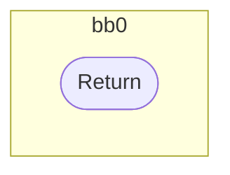
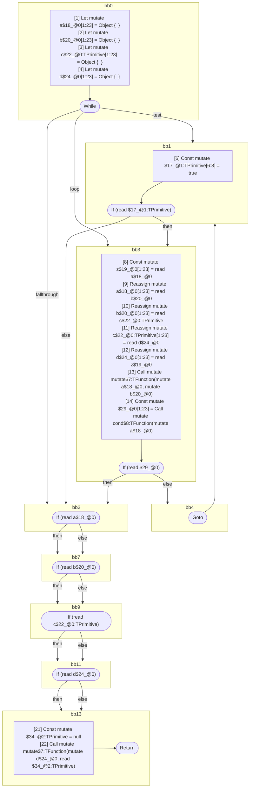

## Input

```javascript
function mutate(x, y) {}
function cond(x) {}

function Component(props) {
  let a = {};
  let b = {};
  let c = {};
  let d = {};
  while (true) {
    let z = a;
    a = b;
    b = c;
    c = d;
    d = z;
    mutate(a, b);
    if (cond(a)) {
      break;
    }
  }

  // all of these tests are seemingly readonly, since the values are never directly
  // mutated again. but they are all aliased by `d`, which is later modified, and
  // these are therefore mutable references:
  if (a) {
  }
  if (b) {
  }
  if (c) {
  }
  if (d) {
  }

  mutate(d, null);
}

```

## HIR

```
bb0:
  [1] Return

```

## Reactive Scopes

```
function mutate(
  x,
  y,
) {
  return
}

```

### CFG



## Code

```javascript
function mutate$0(x$3, y$4) {}

```
## HIR

```
bb0:
  [1] Return

```

## Reactive Scopes

```
function cond(
  x,
) {
  return
}

```

### CFG


## Code

```javascript
function cond$0(x$2) {}

```
## HIR

```
bb0:
  [1] Let mutate a$18_@0[1:23] = Object {  }
  [2] Let mutate b$20_@0[1:23] = Object {  }
  [3] Let mutate c$22_@0:TPrimitive[1:23] = Object {  }
  [4] Let mutate d$24_@0[1:23] = Object {  }
  [5] While test=bb1 loop=bb3 fallthrough=bb2
bb1:
  predecessor blocks: bb0 bb4
  [6] Const mutate $17_@1:TPrimitive[6:8] = true
  [7] If (read $17_@1:TPrimitive) then:bb3 else:bb2 fallthrough=bb2
bb3:
  predecessor blocks: bb1
  [8] Const mutate z$19_@0[1:23] = read a$18_@0
  [9] Reassign mutate a$18_@0[1:23] = read b$20_@0
  [10] Reassign mutate b$20_@0[1:23] = read c$22_@0:TPrimitive
  [11] Reassign mutate c$22_@0:TPrimitive[1:23] = read d$24_@0
  [12] Reassign mutate d$24_@0[1:23] = read z$19_@0
  [13] Call mutate mutate$7:TFunction(mutate a$18_@0, mutate b$20_@0)
  [14] Const mutate $29_@0[1:23] = Call mutate cond$8:TFunction(mutate a$18_@0)
  [15] If (read $29_@0) then:bb2 else:bb4 fallthrough=bb4
bb4:
  predecessor blocks: bb3
  [16] Goto(Continue) bb1
bb2:
  predecessor blocks: bb3 bb1
  [17] If (read a$18_@0) then:bb7 else:bb7 fallthrough=bb7
bb7:
  predecessor blocks: bb2
  [18] If (read b$20_@0) then:bb9 else:bb9 fallthrough=bb9
bb9:
  predecessor blocks: bb7
  [19] If (read c$22_@0:TPrimitive) then:bb11 else:bb11 fallthrough=bb11
bb11:
  predecessor blocks: bb9
  [20] If (read d$24_@0) then:bb13 else:bb13 fallthrough=bb13
bb13:
  predecessor blocks: bb11
  [21] Const mutate $34_@2:TPrimitive = null
  [22] Call mutate mutate$7:TFunction(mutate d$24_@0, read $34_@2:TPrimitive)
  [23] Return

```

## Reactive Scopes

```
function Component(
  props,
) {
  scope @0 [1:23] deps=[] {
    [1] Let mutate a$18_@0[1:23] = Object {  }
    [2] Let mutate b$20_@0[1:23] = Object {  }
    [3] Let mutate c$22_@0:TPrimitive[1:23] = Object {  }
    [4] Let mutate d$24_@0[1:23] = Object {  }
    scope @1 [6:8] deps=[] {
      while (
        [6] Const mutate $17_@1:TPrimitive[6:8] = true
        read $17_@1:TPrimitive
      ) {
        [8] Const mutate z$19_@0[1:23] = read a$18_@0
        [9] Reassign mutate a$18_@0[1:23] = read b$20_@0
        [10] Reassign mutate b$20_@0[1:23] = read c$22_@0:TPrimitive
        [11] Reassign mutate c$22_@0:TPrimitive[1:23] = read d$24_@0
        [12] Reassign mutate d$24_@0[1:23] = read z$19_@0
        [13] Call mutate mutate$7:TFunction(mutate a$18_@0, mutate b$20_@0)
        [14] Const mutate $29_@0[1:23] = Call mutate cond$8:TFunction(mutate a$18_@0)
        if (read $29_@0) {
          break
        }
      }
    }
    if (read a$18_@0) {
    }
    if (read b$20_@0) {
    }
    if (read c$22_@0:TPrimitive) {
    }
    if (read d$24_@0) {
    }
    [21] Const mutate $34_@2:TPrimitive = null
    [22] Call mutate mutate$7:TFunction(mutate d$24_@0, read $34_@2:TPrimitive)
  }
  return
}

```

### CFG



## Code

```javascript
function Component$0(props$12) {
  let a$18 = {};
  let b$20 = {};
  let c$22 = {};
  let d$24 = {};
  bb2: while (true) {
    const z$19 = a$18;
    a$18 = b$20;
    b$20 = c$22;
    c$22 = d$24;
    d$24 = z$19;
    mutate$7(a$18, b$20);

    bb4: if (cond$8(a$18)) {
      break;
    }
  }

  bb7: if (a$18) {
  }

  bb9: if (b$20) {
  }

  bb11: if (c$22) {
  }

  bb13: if (d$24) {
  }

  mutate$7(d$24, null);
}

```
      