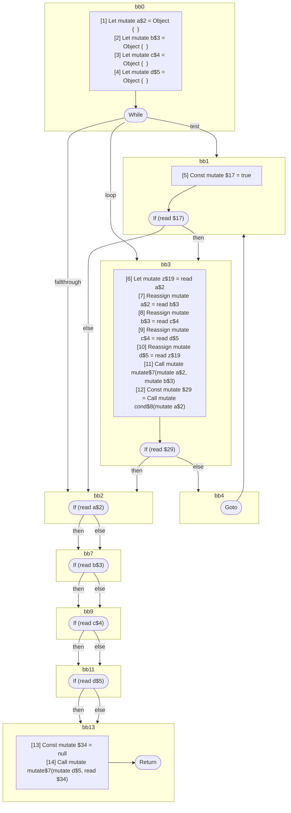

## Input

```javascript
function mutate(x, y) {}
function cond(x) {}

function Component(props) {
  let a = {};
  let b = {};
  let c = {};
  let d = {};
  while (true) {
    let z = a;
    a = b;
    b = c;
    c = d;
    d = z;
    mutate(a, b);
    if (cond(a)) {
      break;
    }
  }

  // all of these tests are seemingly readonly, since the values are never directly
  // mutated again. but they are all aliased by `d`, which is later modified, and
  // these are therefore mutable references:
  if (a) {
  }
  if (b) {
  }
  if (c) {
  }
  if (d) {
  }

  mutate(d, null);
}

```

## HIR

```
bb0:
  Return
```

### CFG


## Code

```javascript
function mutate$0(x$3, y$4) {
  return;
}

```
## HIR

```
bb0:
  Return
```

### CFG


## Code

```javascript
function cond$0(x$2) {
  return;
}

```
## HIR

```
bb0:
  [1] Let mutate a$2 = Object {  }
  [2] Let mutate b$3 = Object {  }
  [3] Let mutate c$4 = Object {  }
  [4] Let mutate d$5 = Object {  }
  While test=bb1 loop=bb3 fallthrough=bb2
bb1:
  predecessor blocks: bb0 bb4
  [5] Const mutate $17 = true
  If (read $17) then:bb3 else:bb2
bb3:
  predecessor blocks: bb1
  [6] Let mutate z$19 = read a$2
  [7] Reassign mutate a$2 = read b$3
  [8] Reassign mutate b$3 = read c$4
  [9] Reassign mutate c$4 = read d$5
  [10] Reassign mutate d$5 = read z$19
  [11] Call mutate mutate$7(mutate a$2, mutate b$3)
  [12] Const mutate $29 = Call mutate cond$8(mutate a$2)
  If (read $29) then:bb2 else:bb4
bb4:
  predecessor blocks: bb3
  Goto(Continue) bb1
bb2:
  predecessor blocks: bb3 bb1
  If (read a$2) then:bb7 else:bb7
bb7:
  predecessor blocks: bb2
  If (read b$3) then:bb9 else:bb9
bb9:
  predecessor blocks: bb7
  If (read c$4) then:bb11 else:bb11
bb11:
  predecessor blocks: bb9
  If (read d$5) then:bb13 else:bb13
bb13:
  predecessor blocks: bb11
  [13] Const mutate $34 = null
  [14] Call mutate mutate$7(mutate d$5, read $34)
  Return
```

### CFG



## Code

```javascript
function Component$0(props$12) {
  let a$2 = {};
  let b$3 = {};
  let c$4 = {};
  let d$5 = {};
  bb2: while (true) {
    let z$19 = a$2;
    a$2 = b$3;
    b$3 = c$4;
    c$4 = d$5;
    d$5 = z$19;
    mutate$7(a$2, b$3);

    bb4: if (cond$8(a$2)) break;
  }

  a$2;
  b$3;
  c$4;
  d$5;
  mutate$7(d$5, null);
  return;
}

```
      