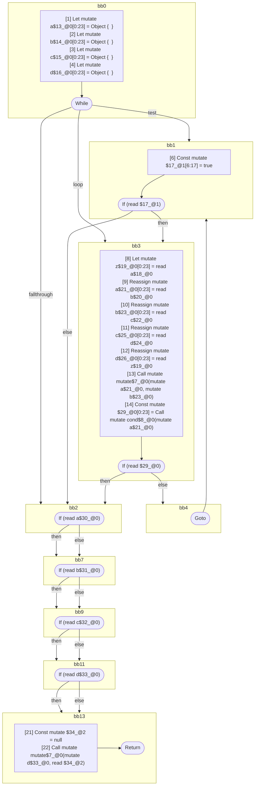

## Input

```javascript
function mutate(x, y) {}
function cond(x) {}

function Component(props) {
  let a = {};
  let b = {};
  let c = {};
  let d = {};
  while (true) {
    let z = a;
    a = b;
    b = c;
    c = d;
    d = z;
    mutate(a, b);
    if (cond(a)) {
      break;
    }
  }

  // all of these tests are seemingly readonly, since the values are never directly
  // mutated again. but they are all aliased by `d`, which is later modified, and
  // these are therefore mutable references:
  if (a) {
  }
  if (b) {
  }
  if (c) {
  }
  if (d) {
  }

  mutate(d, null);
}

```

## HIR

```
bb0:
  [1] Return

```

### CFG


## Code

```javascript
function mutate$0(x$1, y$2) {}

```
## HIR

```
bb0:
  [1] Return

```

### CFG


## Code

```javascript
function cond$0(x$1) {}

```
## HIR

```
bb0:
  [1] Let mutate a$13_@0[0:23] = Object {  }
  [2] Let mutate b$14_@0[0:23] = Object {  }
  [3] Let mutate c$15_@0[0:23] = Object {  }
  [4] Let mutate d$16_@0[0:23] = Object {  }
  [5] While test=bb1 loop=bb3 fallthrough=bb2
bb1:
  predecessor blocks: bb0 bb4
  a$18_@0[0:23]: phi(bb0: a$13_@0, bb4: a$21_@0)
  b$20_@0[0:23]: phi(bb0: b$14_@0, bb4: b$23_@0)
  c$22_@0[0:23]: phi(bb0: c$15_@0, bb4: c$25_@0)
  d$24_@0[0:23]: phi(bb0: d$16_@0, bb4: d$26_@0)
  [6] Const mutate $17_@1[6:17] = true
  [7] If (read $17_@1) then:bb3 else:bb2
bb3:
  predecessor blocks: bb1
  [8] Let mutate z$19_@0[0:23] = read a$18_@0
  [9] Reassign mutate a$21_@0[0:23] = read b$20_@0
  [10] Reassign mutate b$23_@0[0:23] = read c$22_@0
  [11] Reassign mutate c$25_@0[0:23] = read d$24_@0
  [12] Reassign mutate d$26_@0[0:23] = read z$19_@0
  [13] Call mutate mutate$7_@0(mutate a$21_@0, mutate b$23_@0)
  [14] Const mutate $29_@0[0:23] = Call mutate cond$8_@0(mutate a$21_@0)
  [15] If (read $29_@0) then:bb2 else:bb4
bb4:
  predecessor blocks: bb3
  [16] Goto(Continue) bb1
bb2:
  predecessor blocks: bb3 bb1
  a$30_@0[0:23]: phi(bb3: a$21_@0, bb1: a$18_@0)
  b$31_@0[0:23]: phi(bb3: b$23_@0, bb1: b$20_@0)
  c$32_@0[0:23]: phi(bb3: c$25_@0, bb1: c$22_@0)
  d$33_@0[0:23]: phi(bb3: d$26_@0, bb1: d$24_@0)
  [17] If (read a$30_@0) then:bb7 else:bb7
bb7:
  predecessor blocks: bb2
  [18] If (read b$31_@0) then:bb9 else:bb9
bb9:
  predecessor blocks: bb7
  [19] If (read c$32_@0) then:bb11 else:bb11
bb11:
  predecessor blocks: bb9
  [20] If (read d$33_@0) then:bb13 else:bb13
bb13:
  predecessor blocks: bb11
  [21] Const mutate $34_@2 = null
  [22] Call mutate mutate$7_@0(mutate d$33_@0, read $34_@2)
  [23] Return

```

### CFG



## Code

```javascript
function Component$0(props$1) {
  let a$2 = {};
  let b$3 = {};
  let c$4 = {};
  let d$5 = {};
  bb2: while (true) {
    let z$6 = a$2;
    a$2 = b$3;
    b$3 = c$4;
    c$4 = d$5;
    d$5 = z$6;
    mutate$7(a$2, b$3);

    bb4: if (cond$8(a$2)) break;
  }

  bb7: if (a$2) {
  }

  bb9: if (b$3) {
  }

  bb11: if (c$4) {
  }

  bb13: if (d$5) {
  }

  mutate$7(d$5, null);
}

```
      