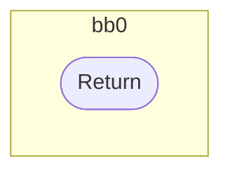
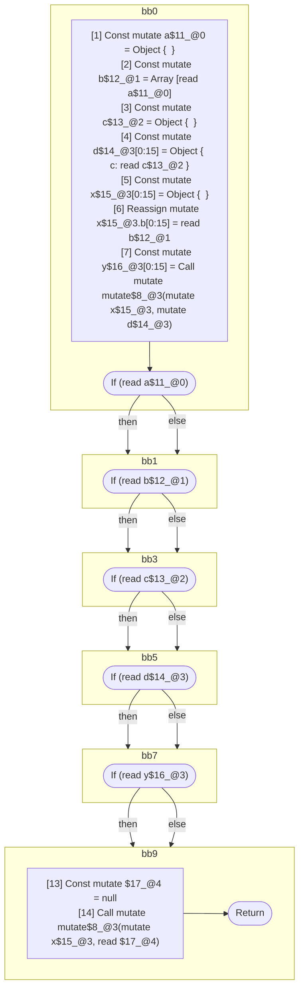

## Input

```javascript
function mutate(x, y) {}

function Component(props) {
  const a = {};
  const b = [a]; // array elements alias
  const c = {};
  const d = { c }; // object values alias

  // capture all the values into this object
  const x = {};
  x.b = b;
  const y = mutate(x, d); // mutation aliases the arg and return value

  // all of these tests are seemingly readonly, since the values are never directly
  // mutated again. but they are all aliased by `x`, which is later modified, and
  // these are therefore mutable references:
  if (a) {
  }
  if (b) {
  }
  if (c) {
  }
  if (d) {
  }
  if (y) {
  }

  // could in theory mutate any of a/b/c/x/z, so the above should be inferred as mutable
  mutate(x, null);
}

```

## HIR

```
bb0:
  [1] Return
```

### CFG



## Code

```javascript
function mutate$0(x$1, y$2) {}

```
## HIR

```
bb0:
  [1] Const mutate a$11_@0 = Object {  }
  [2] Const mutate b$12_@1 = Array [read a$11_@0]
  [3] Const mutate c$13_@2 = Object {  }
  [4] Const mutate d$14_@3[0:15] = Object { c: read c$13_@2 }
  [5] Const mutate x$15_@3[0:15] = Object {  }
  [6] Reassign mutate x$15_@3.b[0:15] = read b$12_@1
  [7] Const mutate y$16_@3[0:15] = Call mutate mutate$8_@3(mutate x$15_@3, mutate d$14_@3)
  [8] If (read a$11_@0) then:bb1 else:bb1
bb1:
  predecessor blocks: bb0
  [9] If (read b$12_@1) then:bb3 else:bb3
bb3:
  predecessor blocks: bb1
  [10] If (read c$13_@2) then:bb5 else:bb5
bb5:
  predecessor blocks: bb3
  [11] If (read d$14_@3) then:bb7 else:bb7
bb7:
  predecessor blocks: bb5
  [12] If (read y$16_@3) then:bb9 else:bb9
bb9:
  predecessor blocks: bb7
  [13] Const mutate $17_@4 = null
  [14] Call mutate mutate$8_@3(mutate x$15_@3, read $17_@4)
  [15] Return
```

### CFG



## Code

```javascript
function Component$0(props$1) {
  const a$2 = {};
  const b$3 = [a$2];
  const c$4 = {};
  const d$5 = {
    c: c$4,
  };
  const x$6 = {};
  x$6.b = b$3;
  const y$7 = mutate$8(x$6, d$5);
  bb1: if (a$2) {
  }

  bb3: if (b$3) {
  }

  bb5: if (c$4) {
  }

  bb7: if (d$5) {
  }

  bb9: if (y$7) {
  }

  mutate$8(x$6, null);
}

```
      