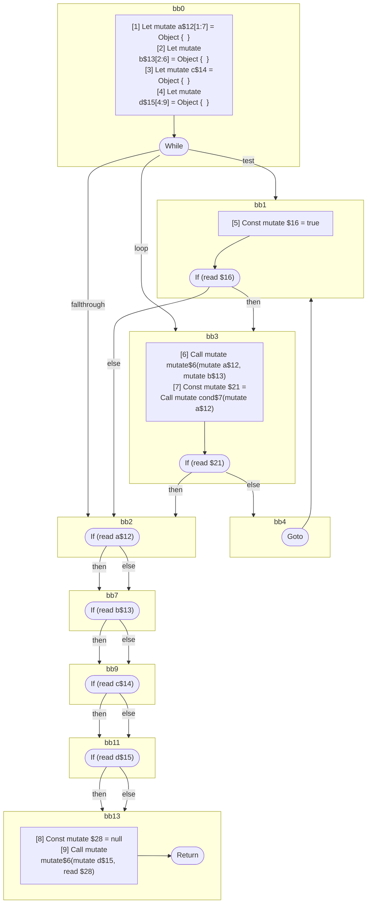

## Input

```javascript
function mutate() {}
function cond() {}

function Component(props) {
  let a = {};
  let b = {};
  let c = {};
  let d = {};
  while (true) {
    mutate(a, b);
    if (cond(a)) {
      break;
    }
  }

  // all of these tests are seemingly readonly, since the values are never directly
  // mutated again. but they are all aliased by `d`, which is later modified, and
  // these are therefore mutable references:
  if (a) {
  }
  if (b) {
  }
  if (c) {
  }
  if (d) {
  }

  mutate(d, null);
}

```

## HIR

```
bb0:
  Return
```

### CFG


## Code

```javascript
function mutate$0() {
  return;
}

```
## HIR

```
bb0:
  Return
```

### CFG


## Code

```javascript
function cond$0() {
  return;
}

```
## HIR

```
bb0:
  [1] Let mutate a$12[1:7] = Object {  }
  [2] Let mutate b$13[2:6] = Object {  }
  [3] Let mutate c$14 = Object {  }
  [4] Let mutate d$15[4:9] = Object {  }
  While test=bb1 loop=bb3 fallthrough=bb2
bb1:
  predecessor blocks: bb0 bb4
  [5] Const mutate $16 = true
  If (read $16) then:bb3 else:bb2
bb3:
  predecessor blocks: bb1
  [6] Call mutate mutate$6(mutate a$12, mutate b$13)
  [7] Const mutate $21 = Call mutate cond$7(mutate a$12)
  If (read $21) then:bb2 else:bb4
bb4:
  predecessor blocks: bb3
  Goto(Continue) bb1
bb2:
  predecessor blocks: bb3 bb1
  If (read a$12) then:bb7 else:bb7
bb7:
  predecessor blocks: bb2
  If (read b$13) then:bb9 else:bb9
bb9:
  predecessor blocks: bb7
  If (read c$14) then:bb11 else:bb11
bb11:
  predecessor blocks: bb9
  If (read d$15) then:bb13 else:bb13
bb13:
  predecessor blocks: bb11
  [8] Const mutate $28 = null
  [9] Call mutate mutate$6(mutate d$15, read $28)
  Return
```

### CFG



## Code

```javascript
function Component$0(props$11) {
  let a$12 = {};
  let b$13 = {};
  let c$14 = {};
  let d$15 = {};
  bb2: while (true) {
    mutate$6(a$12, b$13);

    bb4: if (cond$7(a$12)) break;
  }

  a$12;
  b$13;
  c$14;
  d$15;
  mutate$6(d$15, null);
  return;
}

```
      