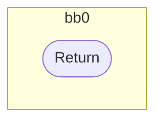
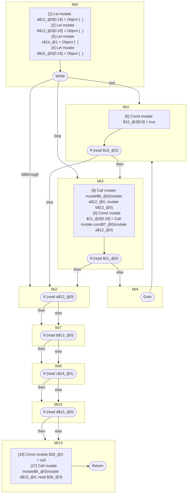

## Input

```javascript
function mutate() {}
function cond() {}

function Component(props) {
  let a = {};
  let b = {};
  let c = {};
  let d = {};
  while (true) {
    mutate(a, b);
    if (cond(a)) {
      break;
    }
  }

  // all of these tests are seemingly readonly, since the values are never directly
  // mutated again. but they are all aliased by `d`, which is later modified, and
  // these are therefore mutable references:
  if (a) {
  }
  if (b) {
  }
  if (c) {
  }
  if (d) {
  }

  mutate(d, null);
}

```

## HIR

```
bb0:
  [1] Return

```

### CFG


## Code

```javascript
function mutate$0() {}

```
## HIR

```
bb0:
  [1] Return

```

### CFG



## Code

```javascript
function cond$0() {}

```
## HIR

```
bb0:
  [1] Let mutate a$12_@0[0:18] = Object {  }
  [2] Let mutate b$13_@0[0:18] = Object {  }
  [3] Let mutate c$14_@1 = Object {  }
  [4] Let mutate d$15_@0[0:18] = Object {  }
  [5] While test=bb1 loop=bb3 fallthrough=bb2
bb1:
  predecessor blocks: bb0 bb4
  [6] Const mutate $16_@2[6:8] = true
  [7] If (read $16_@2) then:bb3 else:bb2
bb3:
  predecessor blocks: bb1
  [8] Call mutate mutate$6_@0(mutate a$12_@0, mutate b$13_@0)
  [9] Const mutate $21_@0[0:18] = Call mutate cond$7_@0(mutate a$12_@0)
  [10] If (read $21_@0) then:bb2 else:bb4
bb4:
  predecessor blocks: bb3
  [11] Goto(Continue) bb1
bb2:
  predecessor blocks: bb3 bb1
  [12] If (read a$12_@0) then:bb7 else:bb7
bb7:
  predecessor blocks: bb2
  [13] If (read b$13_@0) then:bb9 else:bb9
bb9:
  predecessor blocks: bb7
  [14] If (read c$14_@1) then:bb11 else:bb11
bb11:
  predecessor blocks: bb9
  [15] If (read d$15_@0) then:bb13 else:bb13
bb13:
  predecessor blocks: bb11
  [16] Const mutate $28_@3 = null
  [17] Call mutate mutate$6_@0(mutate d$15_@0, read $28_@3)
  [18] Return

```

### CFG



## Code

```javascript
function Component$0(props$1) {
  let a$2 = {};
  let b$3 = {};
  let c$4 = {};
  let d$5 = {};
  bb2: while (true) {
    mutate$6(a$2, b$3);

    bb4: if (cond$7(a$2)) break;
  }

  bb7: if (a$2) {
  }

  bb9: if (b$3) {
  }

  bb11: if (c$4) {
  }

  bb13: if (d$5) {
  }

  mutate$6(d$5, null);
}

```
      