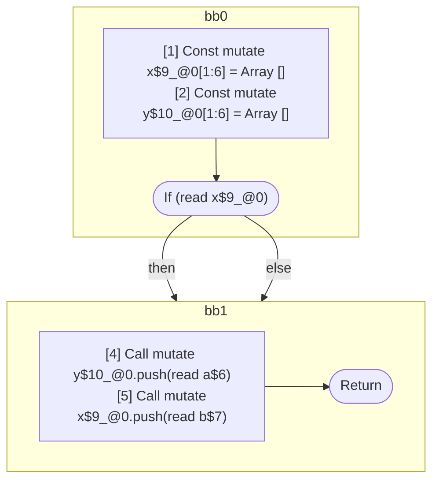

## Input

```javascript
function foo(a, b, c) {
  const x = [];
  const y = [];

  if (x) {
  }

  y.push(a);
  x.push(b);
}

```

## HIR

```
bb0:
  [1] Const mutate x$9_@0[1:6] = Array []
  [2] Const mutate y$10_@0[1:6] = Array []
  [3] If (read x$9_@0) then:bb1 else:bb1
bb1:
  predecessor blocks: bb0
  [4] Call mutate y$10_@0.push(read a$6)
  [5] Call mutate x$9_@0.push(read b$7)
  [6] Return
```

### CFG



## Code

```javascript
function foo$0(a$1, b$2, c$3) {
  const x$4 = [];
  const y$5 = [];
  bb1: if (x$4) {
  }

  y$5.push(a$1);
  x$4.push(b$2);
}

```
      