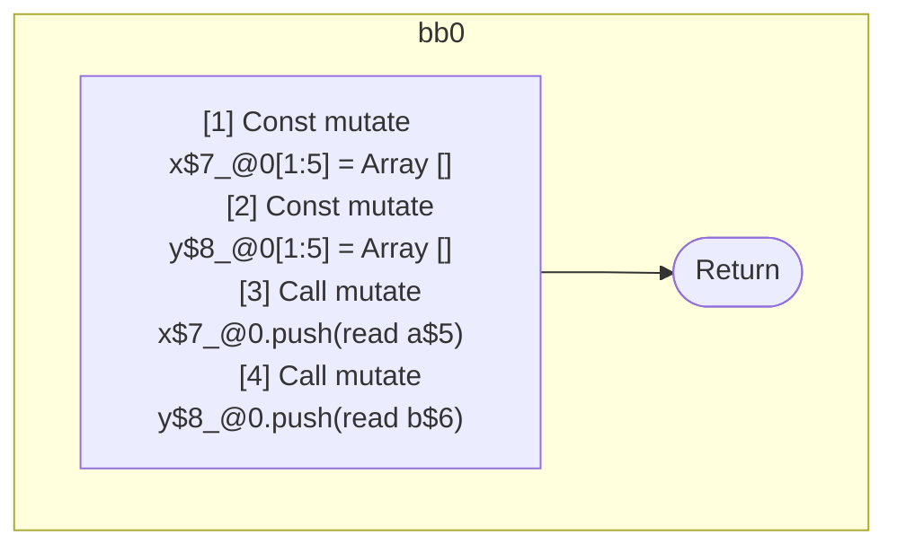

## Input

```javascript
function foo(a, b) {
  let x = [];
  let y = [];
  x.push(a);
  y.push(b);
}

```

## HIR

```
bb0:
  [1] Const mutate x$7_@0[1:5] = Array []
  [2] Const mutate y$8_@0[1:5] = Array []
  [3] Call mutate x$7_@0.push(read a$5)
  [4] Call mutate y$8_@0.push(read b$6)
  [5] Return

```

### CFG



## Code

```javascript
function foo$0(a$5, b$6) {
  const x$7 = [];
  const y$8 = [];
  x$7.push(a$5);
  y$8.push(b$6);
}

```
      