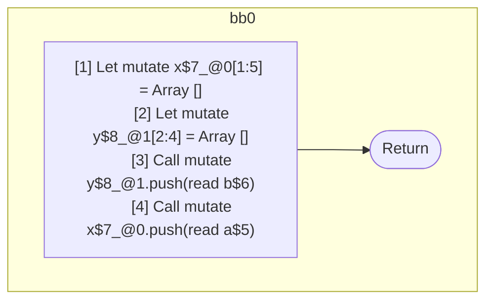

## Input

```javascript
function foo(a, b) {
  let x = [];
  let y = [];
  y.push(b);
  x.push(a);
}

```

## HIR

```
bb0:
  [1] Let mutate x$7_@0[1:5] = Array []
  [2] Let mutate y$8_@1[2:4] = Array []
  [3] Call mutate y$8_@1.push(read b$6)
  [4] Call mutate x$7_@0.push(read a$5)
  [5] Return
scope1 [2:4]:
 - read b$6
 - read a$5
```

### CFG



## Code

```javascript
function foo$0(a$1, b$2) {
  let x$3 = [];
  let y$4 = [];
  y$4.push(b$2);
  x$3.push(a$1);
}

```
      