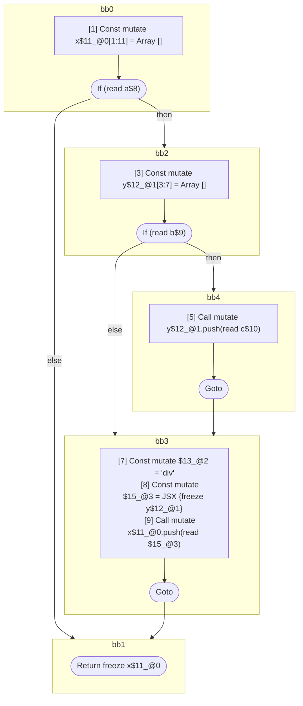

## Input

```javascript
function foo(a, b, c) {
  let x = [];
  if (a) {
    let y = [];
    if (b) {
      y.push(c);
    }

    x.push(<div>{y}</div>);
  }
  return x;
}

```

## HIR

```
bb0:
  [1] Const mutate x$11_@0[1:11] = Array []
  [2] If (read a$8) then:bb2 else:bb1 fallthrough=bb1
bb2:
  predecessor blocks: bb0
  [3] Const mutate y$12_@1[3:7] = Array []
  [4] If (read b$9) then:bb4 else:bb3 fallthrough=bb3
bb4:
  predecessor blocks: bb2
  [5] Call mutate y$12_@1.push(read c$10)
  [6] Goto bb3
bb3:
  predecessor blocks: bb4 bb2
  [7] Const mutate $13_@2 = "div"
  [8] Const mutate $15_@3 = JSX <read $13_@2>{freeze y$12_@1}</read $13_@2>
  [9] Call mutate x$11_@0.push(read $15_@3)
  [10] Goto bb1
bb1:
  predecessor blocks: bb3 bb0
  [11] Return freeze x$11_@0
scope0 [1:11]:
  - dependency: read a$8
scope1 [3:7]:
  - dependency: read c$10
  - dependency: read b$9
scope3 [8:9]:
  - dependency: read $13_@2
  - dependency: freeze y$12_@1
```

## Reactive Scopes

```
function foo(
  a,
  b,
  c,
) {
  scope @0 [1:11] deps=[read a$8] {
    [1] Const mutate x$11_@0[1:11] = Array []
    if (read a$8) {
      scope @1 [3:7] deps=[read c$10, read b$9] {
        [3] Const mutate y$12_@1[3:7] = Array []
        if (read b$9) {
          [5] Call mutate y$12_@1.push(read c$10)
        }
      }
      [7] Const mutate $13_@2 = "div"
      scope @3 [8:9] deps=[read $13_@2, freeze y$12_@1] {
        [8] Const mutate $15_@3 = JSX <read $13_@2>{freeze y$12_@1}</read $13_@2>
      }
      [9] Call mutate x$11_@0.push(read $15_@3)
    }
  }
  return freeze x$11_@0
}

```

### CFG



## Code

```javascript
function foo$0(a$8, b$9, c$10) {
  const x$11 = [];
  bb1: if (a$8) {
    const y$12 = [];

    bb3: if (b$9) {
      y$12.push(c$10);
    }

    x$11.push(<div>{y$12}</div>);
  }

  return x$11;
}

```
      