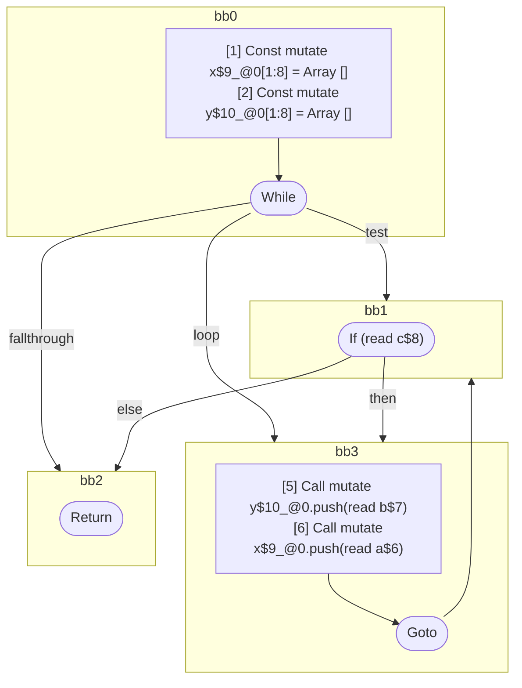

## Input

```javascript
function foo(a, b, c) {
  let x = [];
  let y = [];
  while (c) {
    y.push(b);
    x.push(a);
  }
}

```

## HIR

```
bb0:
  [1] Const mutate x$9_@0[1:8] = Array []
  [2] Const mutate y$10_@0[1:8] = Array []
  [3] While test=bb1 loop=bb3 fallthrough=bb2
bb1:
  predecessor blocks: bb0 bb3
  [4] If (read c$8) then:bb3 else:bb2 fallthrough=bb2
bb3:
  predecessor blocks: bb1
  [5] Call mutate y$10_@0.push(read b$7)
  [6] Call mutate x$9_@0.push(read a$6)
  [7] Goto(Continue) bb1
bb2:
  predecessor blocks: bb1
  [8] Return
scope0 [1:8]:
 - read b$7
 - read a$6
 - read c$8
```

### CFG



## Code

```javascript
function foo$0(a$6, b$7, c$8) {
  const x$9 = [];
  const y$10 = [];
  bb2: while (c$8) {
    y$10.push(b$7);
    x$9.push(a$6);
  }
}

```
      