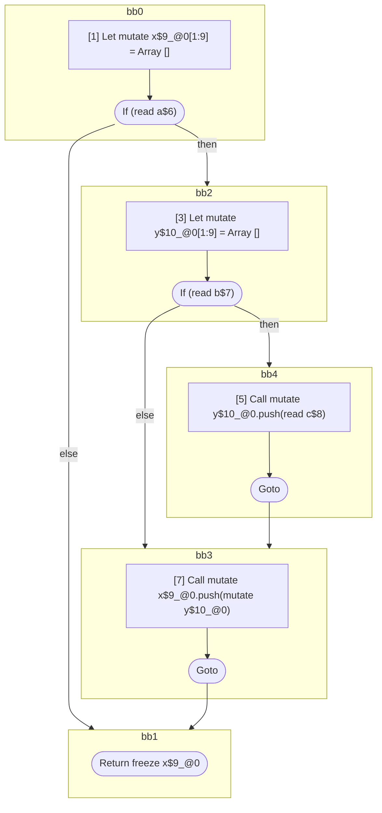

## Input

```javascript
function foo(a, b, c) {
  let x = [];
  if (a) {
    let y = [];
    if (b) {
      y.push(c);
    }

    x.push(y);
  }
  return x;
}

```

## HIR

```
bb0:
  [1] Let mutate x$9_@0[1:9] = Array []
  [2] If (read a$6) then:bb2 else:bb1 fallthrough=bb1
bb2:
  predecessor blocks: bb0
  [3] Let mutate y$10_@0[1:9] = Array []
  [4] If (read b$7) then:bb4 else:bb3 fallthrough=bb3
bb4:
  predecessor blocks: bb2
  [5] Call mutate y$10_@0.push(read c$8)
  [6] Goto bb3
bb3:
  predecessor blocks: bb4 bb2
  [7] Call mutate x$9_@0.push(mutate y$10_@0)
  [8] Goto bb1
bb1:
  predecessor blocks: bb3 bb0
  [9] Return freeze x$9_@0
scope0 [1:9]:
 - read c$8
 - read b$7
 - read a$6
```

### CFG



## Code

```javascript
function foo$0(a$6, b$7, c$8) {
  const x$9 = [];
  bb1: if (a$6) {
    const y$10 = [];

    bb3: if (b$7) {
      y$10.push(c$8);
    }

    x$9.push(y$10);
  }

  return x$9;
}

```
      