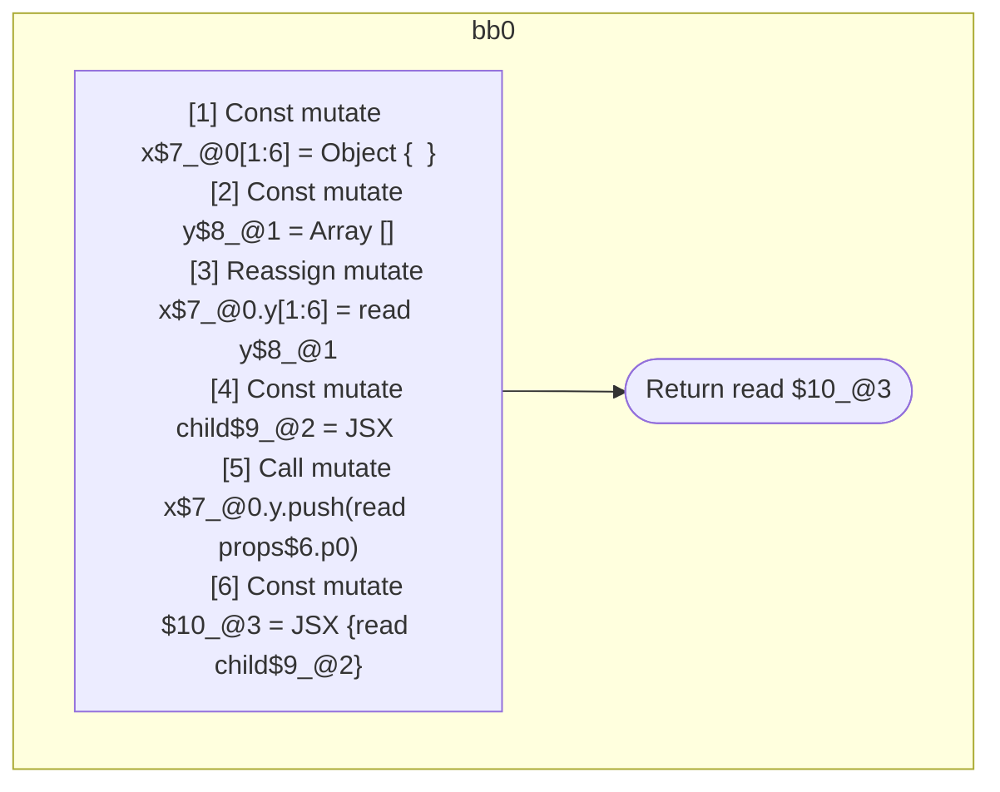

## Input

```javascript
function Component(props) {
  const x = {};
  const y = [];
  x.y = y;
  const child = <Component data={y} />;
  x.y.push(props.p0);
  return <Component data={x}>{child}</Component>;
}

```

## HIR

```
bb0:
  [1] Const mutate x$7_@0[1:6] = Object {  }
  [2] Const mutate y$8_@1 = Array []
  [3] Reassign mutate x$7_@0.y[1:6] = read y$8_@1
  [4] Const mutate child$9_@2 = JSX <read Component$0 data={freeze y$8_@1} ></read Component$0>
  [5] Call mutate x$7_@0.y.push(read props$6.p0)
  [6] Const mutate $10_@3 = JSX <read Component$0 data={freeze x$7_@0} >{read child$9_@2}</read Component$0>
  [7] Return read $10_@3
```

### CFG



## Code

```javascript
function Component$0(props$1) {
  const x$2 = {};
  const y$3 = [];
  x$2.y = y$3;
  const child$4 = <Component$0 data={y$3}></Component$0>;
  x$2.y.push(props$1.p0);
  return <Component$0 data={x$2}>{child$4}</Component$0>;
}

```
      