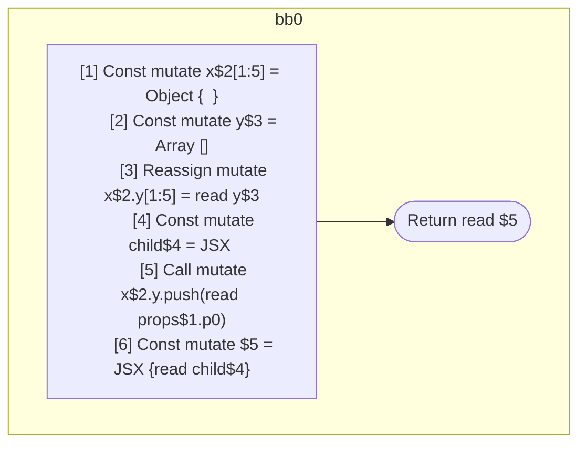

## Input

```javascript
function Component(props) {
  const x = {};
  const y = [];
  x.y = y;
  const child = <Component data={y} />;
  x.y.push(props.p0);
  return <Component data={x}>{child}</Component>;
}

```

## HIR

```
bb0:
  [1] Const mutate x$2[1:5] = Object {  }
  [2] Const mutate y$3 = Array []
  [3] Reassign mutate x$2.y[1:5] = read y$3
  [4] Const mutate child$4 = JSX <read Component$0 data={freeze y$3} ></read Component$0>
  [5] Call mutate x$2.y.push(read props$1.p0)
  [6] Const mutate $5 = JSX <read Component$0 data={freeze x$2} >{read child$4}</read Component$0>
  Return read $5
```

### CFG



## Code

```javascript
function Component$0(props$1) {
  const x$2 = {};
  const y$3 = [];
  x$2.y = y$3;
  const child$4 = <Component$0 data={y$3}></Component$0>;
  x$2.y.push(props$1.p0);
  return <Component$0 data={x$2}>{child$4}</Component$0>;
}

```
      