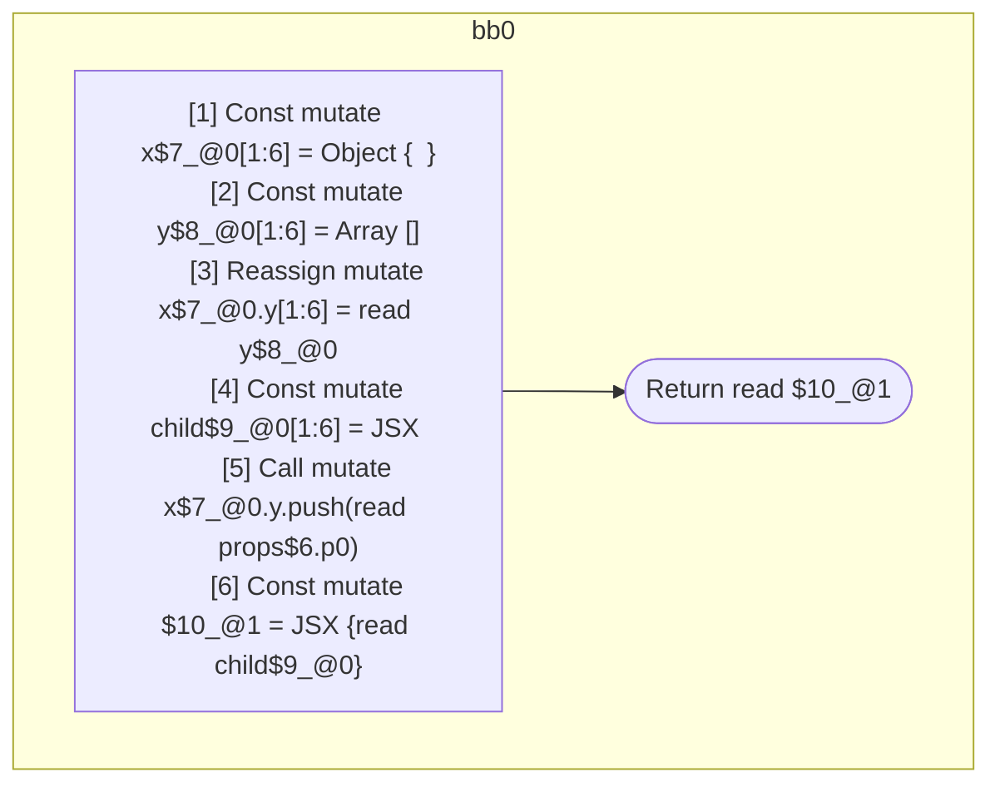

## Input

```javascript
function Component(props) {
  const x = {};
  const y = [];
  x.y = y;
  const child = <Component data={y} />;
  x.y.push(props.p0);
  return <Component data={x}>{child}</Component>;
}

```

## HIR

```
bb0:
  [1] Const mutate x$7_@0[1:6] = Object {  }
  [2] Const mutate y$8_@0[1:6] = Array []
  [3] Reassign mutate x$7_@0.y[1:6] = read y$8_@0
  [4] Const mutate child$9_@0[1:6] = JSX <read Component$0 data={freeze y$8_@0} ></read Component$0>
  [5] Call mutate x$7_@0.y.push(read props$6.p0)
  [6] Const mutate $10_@1 = JSX <read Component$0 data={freeze x$7_@0} >{read child$9_@0}</read Component$0>
  [7] Return read $10_@1
scope0 [1:6]:
  - dependency: read Component$0
  - dependency: read props$6.p0
scope1 [6:7]:
  - dependency: read Component$0
  - dependency: freeze x$7_@0
  - dependency: read child$9_@0
```

## Reactive Scopes

```
function Component(
  props,
) {
  scope @0 [1:6] deps=[read Component$0, read props$6.p0] {
    [1] Const mutate x$7_@0[1:6] = Object {  }
    [2] Const mutate y$8_@0[1:6] = Array []
    [3] Reassign mutate x$7_@0.y[1:6] = read y$8_@0
    [4] Const mutate child$9_@0[1:6] = JSX <read Component$0 data={freeze y$8_@0} ></read Component$0>
    [5] Call mutate x$7_@0.y.push(read props$6.p0)
  }
  scope @1 [6:7] deps=[read Component$0, freeze x$7_@0, read child$9_@0] {
    [6] Const mutate $10_@1 = JSX <read Component$0 data={freeze x$7_@0} >{read child$9_@0}</read Component$0>
  }
  return read $10_@1
}

```

### CFG



## Code

```javascript
function Component$0(props$6) {
  const x$7 = {};
  const y$8 = [];
  x$7.y = y$8;
  const child$9 = <Component$0 data={y$8}></Component$0>;
  x$7.y.push(props$6.p0);
  return <Component$0 data={x$7}>{child$9}</Component$0>;
}

```
      