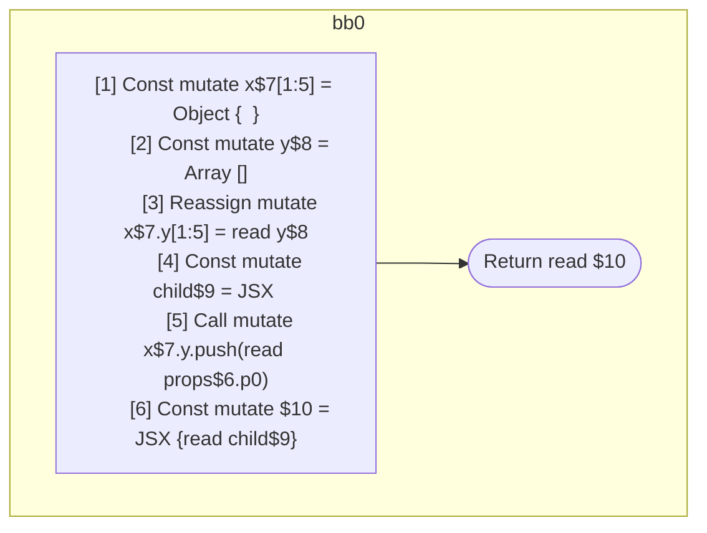

## Input

```javascript
function Component(props) {
  const x = {};
  const y = [];
  x.y = y;
  const child = <Component data={y} />;
  x.y.push(props.p0);
  return <Component data={x}>{child}</Component>;
}

```

## HIR

```
bb0:
  [1] Const mutate x$7[1:5] = Object {  }
  [2] Const mutate y$8 = Array []
  [3] Reassign mutate x$7.y[1:5] = read y$8
  [4] Const mutate child$9 = JSX <read Component$0 data={freeze y$8} ></read Component$0>
  [5] Call mutate x$7.y.push(read props$6.p0)
  [6] Const mutate $10 = JSX <read Component$0 data={freeze x$7} >{read child$9}</read Component$0>
  Return read $10
```

### CFG



## Code

```javascript
function Component$0(props$6) {
  const x$7 = {};
  const y$8 = [];
  x$7 = y$8;
  const child$9 = <Component$0 data={y$8}></Component$0>;
  x$7.y.push(props$6.p0);
  return <Component$0 data={x$7}>{child$9}</Component$0>;
}

```
      