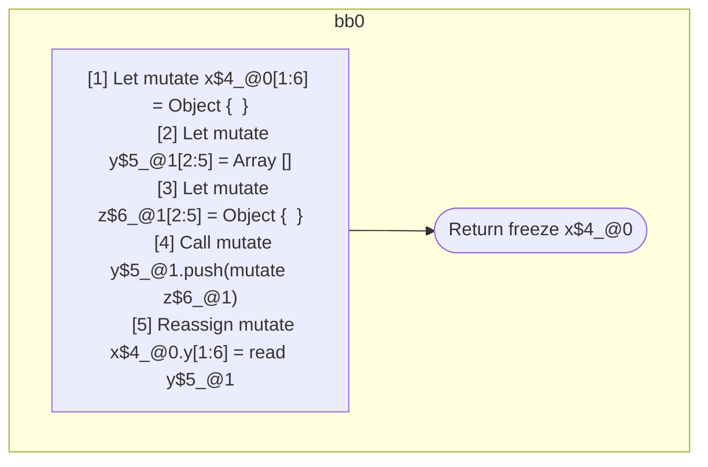

## Input

```javascript
function foo() {
  let x = {};
  let y = [];
  let z = {};
  y.push(z);
  x.y = y;

  return x;
}

```

## HIR

```
bb0:
  [1] Let mutate x$4_@0[1:6] = Object {  }
  [2] Let mutate y$5_@1[2:5] = Array []
  [3] Let mutate z$6_@1[2:5] = Object {  }
  [4] Call mutate y$5_@1.push(mutate z$6_@1)
  [5] Reassign mutate x$4_@0.y[1:6] = read y$5_@1
  [6] Return freeze x$4_@0
scope1 [2:5]:
 - mutate x$4_@0.y
```

### CFG



## Code

```javascript
function foo$0() {
  const x$4 = {};
  const y$5 = [];
  const z$6 = {};
  y$5.push(z$6);
  x$4.y = y$5;
  return x$4;
}

```
      