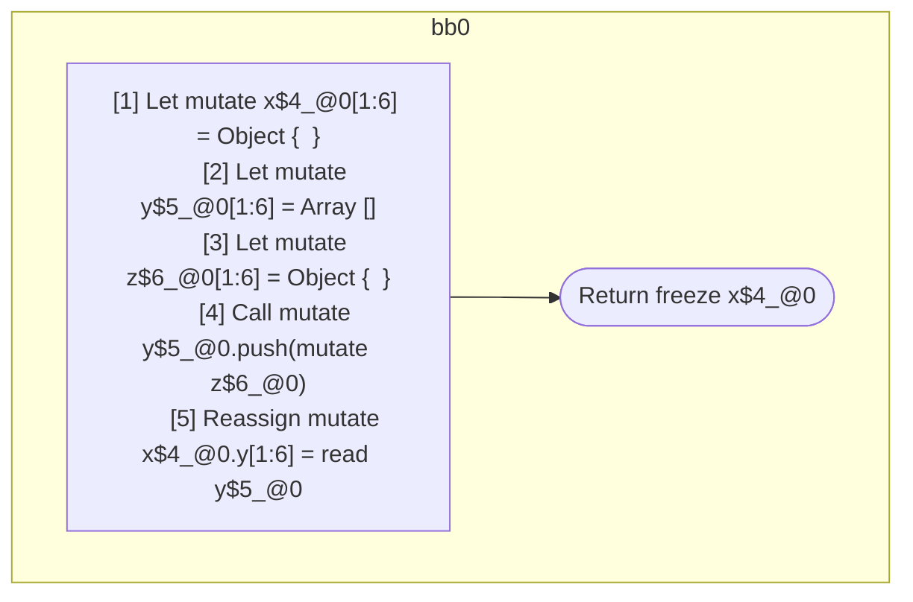

## Input

```javascript
function foo() {
  let x = {};
  let y = [];
  let z = {};
  y.push(z);
  x.y = y;

  return x;
}

```

## HIR

```
bb0:
  [1] Let mutate x$4_@0[1:6] = Object {  }
  [2] Let mutate y$5_@0[1:6] = Array []
  [3] Let mutate z$6_@0[1:6] = Object {  }
  [4] Call mutate y$5_@0.push(mutate z$6_@0)
  [5] Reassign mutate x$4_@0.y[1:6] = read y$5_@0
  [6] Return freeze x$4_@0

```

### CFG



## Code

```javascript
function foo$0() {
  let x$1 = {};
  let y$2 = [];
  let z$3 = {};
  y$2.push(z$3);
  x$1.y = y$2;
  return x$1;
}

```
      