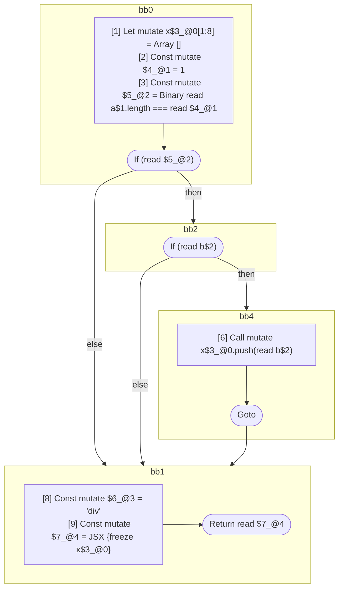

## Input

```javascript
function f(a, b) {
  let x = []; // <- x starts being mutable here.
  if (a.length === 1) {
    if (b) {
      x.push(b); // <- x stops being mutable here.
    }
  }

  return <div>{x}</div>;
}

```

## HIR

```
bb0:
  [1] Let mutate x$3_@0[1:8] = Array []
  [2] Const mutate $4_@1 = 1
  [3] Const mutate $5_@2 = Binary read a$1.length === read $4_@1
  [4] If (read $5_@2) then:bb2 else:bb1
bb2:
  predecessor blocks: bb0
  [5] If (read b$2) then:bb4 else:bb1
bb4:
  predecessor blocks: bb2
  [6] Call mutate x$3_@0.push(read b$2)
  [7] Goto bb1
bb1:
  predecessor blocks: bb4 bb2 bb0
  [8] Const mutate $6_@3 = "div"
  [9] Const mutate $7_@4 = JSX <read $6_@3>{freeze x$3_@0}</read $6_@3>
  [10] Return read $7_@4
```

### CFG



## Code

```javascript
function f$0(a$1, b$2) {
  let x$3 = [];
  bb1: if (a$1.length === 1) {
    if (b$2) {
      x$3.push(b$2);
    }
  }

  return <div>{x$3}</div>;
}

```
      