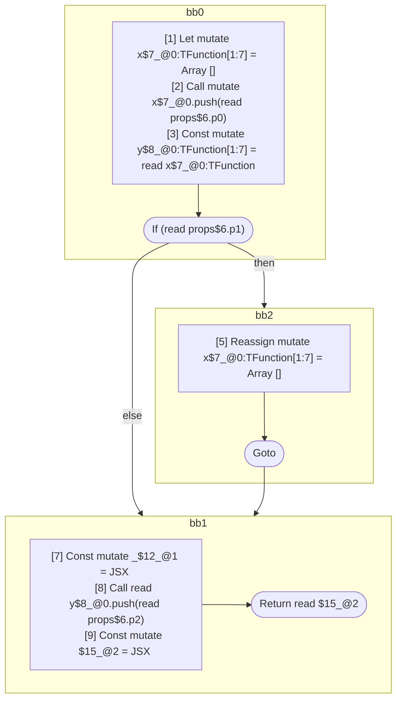

## Input

```javascript
function Component(props) {
  let x = [];
  x.push(props.p0);
  let y = x;

  if (props.p1) {
    x = [];
  }

  let _ = <Component x={x} />;
  y.push(props.p2);

  return <Component x={x} y={y} />;
}

```

## HIR

```
bb0:
  [1] Let mutate x$7_@0:TFunction[1:7] = Array []
  [2] Call mutate x$7_@0.push(read props$6.p0)
  [3] Const mutate y$8_@0:TFunction[1:7] = read x$7_@0:TFunction
  [4] If (read props$6.p1) then:bb2 else:bb1 fallthrough=bb1
bb2:
  predecessor blocks: bb0
  [5] Reassign mutate x$7_@0:TFunction[1:7] = Array []
  [6] Goto bb1
bb1:
  predecessor blocks: bb2 bb0
  [7] Const mutate _$12_@1 = JSX <read Component$0 x={freeze x$7_@0:TFunction} ></read Component$0>
  [8] Call read y$8_@0.push(read props$6.p2)
  [9] Const mutate $15_@2 = JSX <read Component$0 x={read x$7_@0:TFunction} y={read y$8_@0:TFunction} ></read Component$0>
  [10] Return read $15_@2
scope0 [1:7]:
  - dependency: read props$6.p0
  - dependency: read props$6.p1
scope1 [7:8]:
  - dependency: read Component$0
  - dependency: freeze x$7_@0:TFunction
  - dependency: read y$8_@0.push
  - dependency: read props$6.p2
scope2 [9:10]:
  - dependency: read Component$0
  - dependency: read x$7_@0:TFunction
  - dependency: read y$8_@0:TFunction
```

## Reactive Scopes

```
function Component(
  props,
) {
  scope @0 [1:7] deps=[read props$6.p0, read props$6.p1] {
    [1] Let mutate x$7_@0:TFunction[1:7] = Array []
    [2] Call mutate x$7_@0.push(read props$6.p0)
    [3] Const mutate y$8_@0:TFunction[1:7] = read x$7_@0:TFunction
    if (read props$6.p1) {
      [5] Reassign mutate x$7_@0:TFunction[1:7] = Array []
    }
  }
  scope @1 [7:8] deps=[read Component$0, freeze x$7_@0:TFunction, read y$8_@0.push, read props$6.p2] {
    [7] Const mutate _$12_@1 = JSX <read Component$0 x={freeze x$7_@0:TFunction} ></read Component$0>
  }
  [8] Call read y$8_@0.push(read props$6.p2)
  scope @2 [9:10] deps=[read Component$0, read x$7_@0:TFunction, read y$8_@0:TFunction] {
    [9] Const mutate $15_@2 = JSX <read Component$0 x={read x$7_@0:TFunction} y={read y$8_@0:TFunction} ></read Component$0>
  }
  return read $15_@2
}

```

### CFG



## Code

```javascript
function Component$0(props$6) {
  let x$7 = [];
  x$7.push(props$6.p0);
  const y$8 = x$7;
  bb1: if (props$6.p1) {
    x$7 = [];
  }

  const _$12 = <Component$0 x={x$7}></Component$0>;

  y$8.push(props$6.p2);
  return <Component$0 x={x$7} y={y$8}></Component$0>;
}

```
      