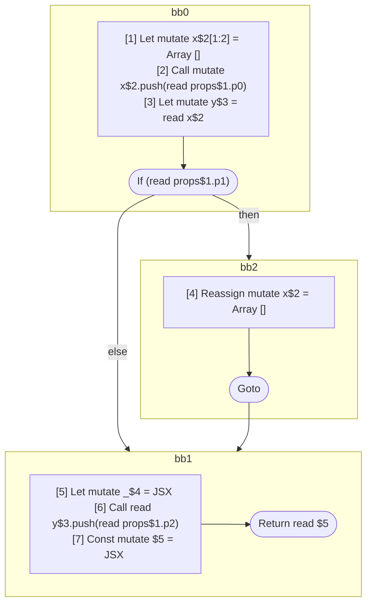

## Input

```javascript
function Component(props) {
  let x = [];
  x.push(props.p0);
  let y = x;

  if (props.p1) {
    x = [];
  }

  let _ = <Component x={x} />;
  y.push(props.p2);

  return <Component x={x} y={y} />;
}

```

## HIR

```
bb0:
  [1] Let mutate x$2[1:2] = Array []
  [2] Call mutate x$2.push(read props$1.p0)
  [3] Let mutate y$3 = read x$2
  If (read props$1.p1) then:bb2 else:bb1
bb2:
  predecessor blocks: bb0
  [4] Reassign mutate x$2 = Array []
  Goto bb1
bb1:
  predecessor blocks: bb2 bb0
  [5] Let mutate _$4 = JSX <read Component$0 x={freeze x$2} ></read Component$0>
  [6] Call read y$3.push(read props$1.p2)
  [7] Const mutate $5 = JSX <read Component$0 x={read x$2} y={read y$3} ></read Component$0>
  Return read $5
```

### CFG



## Code

```javascript
function Component$0(props$1) {
  let x$2 = [];
  x$2.push(props$1.p0);
  let y$3 = x$2;
  bb1: if (props$1.p1) {
    x$2 = [];
  }

  let _$4 = <Component$0 x={x$2}></Component$0>;

  y$3.push(props$1.p2);
  return <Component$0 x={x$2} y={y$3}></Component$0>;
}

```
      