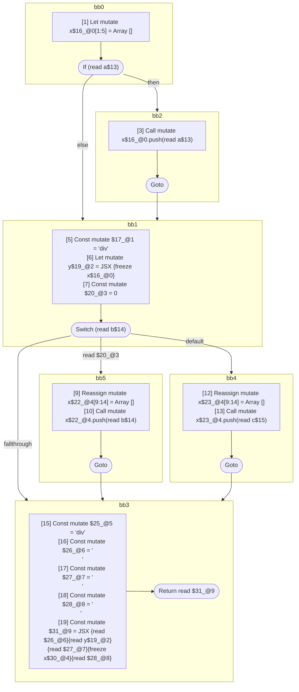

## Input

```javascript
function foo(a, b, c) {
  let x = [];
  if (a) {
    x.push(a);
  }
  let y = <div>{x}</div>;

  switch (b) {
    case 0: {
      x = [];
      x.push(b);
      break;
    }
    default: {
      x = [];
      x.push(c);
    }
  }
  return (
    <div>
      {y}
      {x}
    </div>
  );
}

```

## HIR

```
bb0:
  [1] Let mutate x$16_@0[1:5] = Array []
  [2] If (read a$13) then:bb2 else:bb1
bb2:
  predecessor blocks: bb0
  [3] Call mutate x$16_@0.push(read a$13)
  [4] Goto bb1
bb1:
  predecessor blocks: bb2 bb0
  [5] Const mutate $17_@1 = "div"
  [6] Let mutate y$19_@2 = JSX <read $17_@1>{freeze x$16_@0}</read $17_@1>
  [7] Const mutate $20_@3 = 0
  [8] Switch (read b$14)
    Case read $20_@3: bb5
    Default: bb4
bb5:
  predecessor blocks: bb1
  [9] Reassign mutate x$22_@4[9:14] = Array []
  [10] Call mutate x$22_@4.push(read b$14)
  [11] Goto bb3
bb4:
  predecessor blocks: bb1
  [12] Reassign mutate x$23_@4[9:14] = Array []
  [13] Call mutate x$23_@4.push(read c$15)
  [14] Goto bb3
bb3:
  predecessor blocks: bb5 bb4
  x$30_@4[9:14]: phi(bb5: x$22_@4, bb4: x$23_@4)
  [15] Const mutate $25_@5 = "div"
  [16] Const mutate $26_@6 = "\n      "
  [17] Const mutate $27_@7 = "\n      "
  [18] Const mutate $28_@8 = "\n    "
  [19] Const mutate $31_@9 = JSX <read $25_@5>{read $26_@6}{read y$19_@2}{read $27_@7}{freeze x$30_@4}{read $28_@8}</read $25_@5>
  [20] Return read $31_@9
```

### CFG



## Code

```javascript
function foo$0(a$1, b$2, c$3) {
  let x$4 = [];
  bb1: if (a$1) {
    x$4.push(a$1);
  }

  let y$5 = <div>{x$4}</div>;

  bb3: switch (b$2) {
    case 0: {
      x$4 = [];
      x$4.push(b$2);
      break bb3;
    }

    default: {
      x$4 = [];
      x$4.push(c$3);
    }
  }

  return (
    <div>
      {y$5}
      {x$4}
    </div>
  );
}

```
      