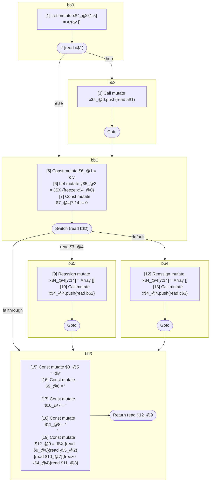

## Input

```javascript
function foo(a, b, c) {
  let x = [];
  if (a) {
    x.push(a);
  }
  let y = <div>{x}</div>;

  switch (b) {
    case 0: {
      x = [];
      x.push(b);
      break;
    }
    default: {
      x = [];
      x.push(c);
    }
  }
  return (
    <div>
      {y}
      {x}
    </div>
  );
}

```

## HIR

```
bb0:
  [1] Let mutate x$4_@0[1:5] = Array []
  [2] If (read a$1) then:bb2 else:bb1
bb2:
  predecessor blocks: bb0
  [3] Call mutate x$4_@0.push(read a$1)
  [4] Goto bb1
bb1:
  predecessor blocks: bb2 bb0
  [5] Const mutate $6_@1 = "div"
  [6] Let mutate y$5_@2 = JSX <read $6_@1>{freeze x$4_@0}</read $6_@1>
  [7] Const mutate $7_@4[7:14] = 0
  [8] Switch (read b$2)
    Case read $7_@4: bb5
    Default: bb4
bb5:
  predecessor blocks: bb1
  [9] Reassign mutate x$4_@4[7:14] = Array []
  [10] Call mutate x$4_@4.push(read b$2)
  [11] Goto bb3
bb4:
  predecessor blocks: bb1
  [12] Reassign mutate x$4_@4[7:14] = Array []
  [13] Call mutate x$4_@4.push(read c$3)
  [14] Goto bb3
bb3:
  predecessor blocks: bb5 bb4
  [15] Const mutate $8_@5 = "div"
  [16] Const mutate $9_@6 = "\n      "
  [17] Const mutate $10_@7 = "\n      "
  [18] Const mutate $11_@8 = "\n    "
  [19] Const mutate $12_@9 = JSX <read $8_@5>{read $9_@6}{read y$5_@2}{read $10_@7}{freeze x$4_@4}{read $11_@8}</read $8_@5>
  [20] Return read $12_@9
```

### CFG



## Code

```javascript
function foo$0(a$1, b$2, c$3) {
  let x$4 = [];
  bb1: if (a$1) {
    x$4.push(a$1);
  }

  let y$5 = <div>{x$4}</div>;

  bb3: switch (b$2) {
    case 0: {
      x$4 = [];
      x$4.push(b$2);
      break bb3;
    }

    default: {
      x$4 = [];
      x$4.push(c$3);
    }
  }

  return (
    <div>
      {y$5}
      {x$4}
    </div>
  );
}

```
      