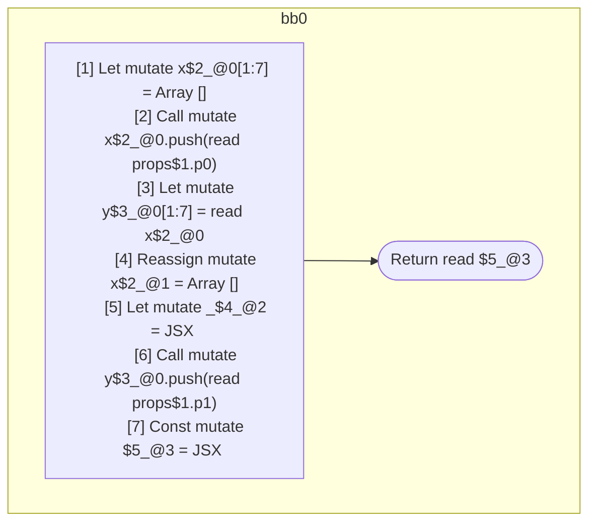

## Input

```javascript
function Component(props) {
  let x = [];
  x.push(props.p0);
  let y = x;

  x = [];
  let _ = <Component x={x} />;

  y.push(props.p1);

  return <Component x={x} y={y} />;
}

```

## HIR

```
bb0:
  [1] Let mutate x$2_@0[1:7] = Array []
  [2] Call mutate x$2_@0.push(read props$1.p0)
  [3] Let mutate y$3_@0[1:7] = read x$2_@0
  [4] Reassign mutate x$2_@1 = Array []
  [5] Let mutate _$4_@2 = JSX <read Component$0 x={freeze x$2_@1} ></read Component$0>
  [6] Call mutate y$3_@0.push(read props$1.p1)
  [7] Const mutate $5_@3 = JSX <read Component$0 x={read x$2_@1} y={freeze y$3_@0} ></read Component$0>
  [8] Return read $5_@3
```

### CFG



## Code

```javascript
function Component$0(props$1) {
  let x$2 = [];
  x$2.push(props$1.p0);
  let y$3 = x$2;
  x$2 = [];
  let _$4 = <Component$0 x={x$2}></Component$0>;

  y$3.push(props$1.p1);
  return <Component$0 x={x$2} y={y$3}></Component$0>;
}

```
      