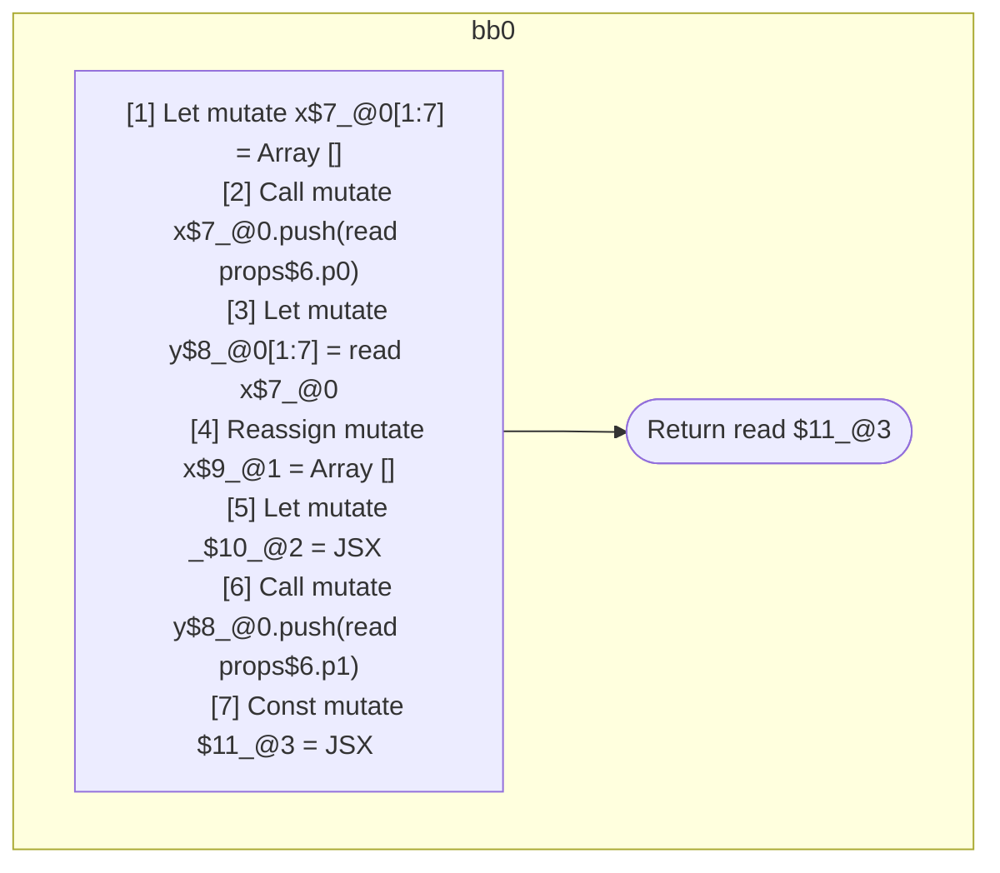

## Input

```javascript
function Component(props) {
  let x = [];
  x.push(props.p0);
  let y = x;

  x = [];
  let _ = <Component x={x} />;

  y.push(props.p1);

  return <Component x={x} y={y} />;
}

```

## HIR

```
bb0:
  [1] Let mutate x$7_@0[1:7] = Array []
  [2] Call mutate x$7_@0.push(read props$6.p0)
  [3] Let mutate y$8_@0[1:7] = read x$7_@0
  [4] Reassign mutate x$9_@1 = Array []
  [5] Let mutate _$10_@2 = JSX <read Component$0 x={freeze x$9_@1} ></read Component$0>
  [6] Call mutate y$8_@0.push(read props$6.p1)
  [7] Const mutate $11_@3 = JSX <read Component$0 x={read x$9_@1} y={freeze y$8_@0} ></read Component$0>
  [8] Return read $11_@3
scope0 [1:7]:
 - read props$6.p0
scope2 [5:6]:
 - read Component$0
 - freeze x$9_@1
 - read props$6.p1
scope3 [7:8]:
 - read Component$0
 - read x$9_@1
 - freeze y$8_@0
```

### CFG



## Code

```javascript
function Component$0(props$6) {
  const x$7 = [];
  x$7.push(props$6.p0);
  const y$8 = x$7;
  const x$9 = [];
  const _$10 = <Component$0 x={x$9}></Component$0>;

  y$8.push(props$6.p1);
  return <Component$0 x={x$9} y={y$8}></Component$0>;
}

```
      