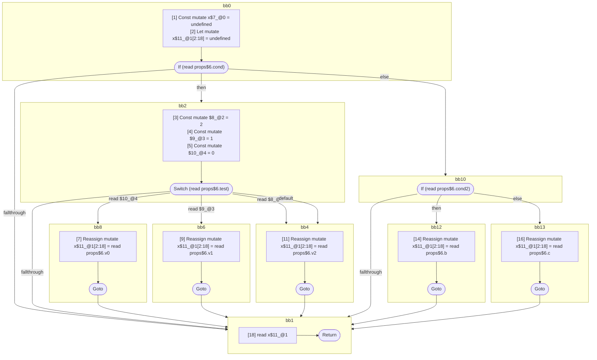

## Input

```javascript
function Component(props) {
  let x;
  if (props.cond) {
    switch (props.test) {
      case 0: {
        x = props.v0;
        break;
      }
      case 1: {
        x = props.v1;
        break;
      }
      case 2: {
      }
      default: {
        x = props.v2;
      }
    }
  } else {
    if (props.cond2) {
      x = props.b;
    } else {
      x = props.c;
    }
  }
  x;
}

```

## HIR

```
bb0:
  [1] Const mutate x$7_@0 = undefined
  [2] Let mutate x$11_@1[2:18] = undefined
  [2] If (read props$6.cond) then:bb2 else:bb10 fallthrough=bb1
bb2:
  predecessor blocks: bb0
  [3] Const mutate $8_@2 = 2
  [4] Const mutate $9_@3 = 1
  [5] Const mutate $10_@4 = 0
  [6] Switch (read props$6.test)
    Case read $10_@4: bb8
    Case read $9_@3: bb6
    Case read $8_@2: bb4
    Default: bb4
    Fallthrough: bb1
bb8:
  predecessor blocks: bb2
  [7] Reassign mutate x$11_@1[2:18] = read props$6.v0
  [8] Goto bb1
bb6:
  predecessor blocks: bb2
  [9] Reassign mutate x$11_@1[2:18] = read props$6.v1
  [10] Goto bb1
bb4:
  predecessor blocks: bb2
  [11] Reassign mutate x$11_@1[2:18] = read props$6.v2
  [12] Goto bb1
bb10:
  predecessor blocks: bb0
  [13] If (read props$6.cond2) then:bb12 else:bb13 fallthrough=bb1
bb12:
  predecessor blocks: bb10
  [14] Reassign mutate x$11_@1[2:18] = read props$6.b
  [15] Goto bb1
bb13:
  predecessor blocks: bb10
  [16] Reassign mutate x$11_@1[2:18] = read props$6.c
  [17] Goto bb1
bb1:
  predecessor blocks: bb8 bb6 bb4 bb12 bb13
  [18] read x$11_@1
  [19] Return
scope1 [2:18]:
  - dependency: read props$6.v2
  - dependency: read props$6.v1
  - dependency: read props$6.v0
  - dependency: read props$6.test
  - dependency: read props$6.b
  - dependency: read props$6.c
  - dependency: read props$6.cond2
  - dependency: read props$6.cond
```

## Reactive Scopes

```
function Component(
  props,
) {
  [1] Const mutate x$7_@0 = undefined
  scope @1 [2:18] deps=[read props$6.v2, read props$6.v1, read props$6.v0, read props$6.test, read props$6.b, read props$6.c, read props$6.cond2, read props$6.cond] {
    [2] Let mutate x$11_@1[2:18] = undefined
    if (read props$6.cond) {
      [3] Const mutate $8_@2 = 2
      [4] Const mutate $9_@3 = 1
      [5] Const mutate $10_@4 = 0
      switch (read props$6.test) {
        case read $10_@4: {
            [7] Reassign mutate x$11_@1[2:18] = read props$6.v0
            break bb1
        }
        case read $9_@3: {
            [9] Reassign mutate x$11_@1[2:18] = read props$6.v1
            break bb1
        }
        case read $8_@2: {
        }
        default: {
            [11] Reassign mutate x$11_@1[2:18] = read props$6.v2
        }
      }
    } else {
      if (read props$6.cond2) {
        [14] Reassign mutate x$11_@1[2:18] = read props$6.b
      } else {
        [16] Reassign mutate x$11_@1[2:18] = read props$6.c
      }
    }
  }
  [18] read x$11_@1
  return
}

```

### CFG



## Code

```javascript
function Component$0(props$6) {
  const x$7 = undefined;
  let x$11 = undefined;
  bb1: if (props$6.cond) {
    switch (props$6.test) {
      case 0: {
        x$11 = props$6.v0;
        break bb1;
      }

      case 1: {
        x$11 = props$6.v1;
        break bb1;
      }

      case 2: {
      }

      default: {
        x$11 = props$6.v2;
      }
    }
  } else {
    if (props$6.cond2) {
      x$11 = props$6.b;
    } else {
      x$11 = props$6.c;
    }
  }

  x$11;
}

```
      