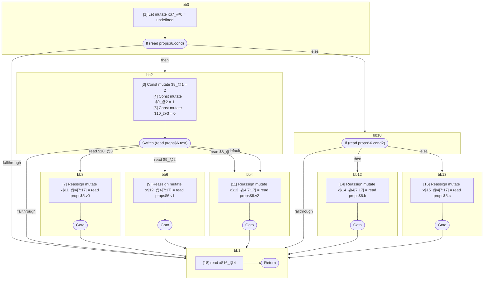

## Input

```javascript
function Component(props) {
  let x;
  if (props.cond) {
    switch (props.test) {
      case 0: {
        x = props.v0;
        break;
      }
      case 1: {
        x = props.v1;
        break;
      }
      case 2: {
      }
      default: {
        x = props.v2;
      }
    }
  } else {
    if (props.cond2) {
      x = props.b;
    } else {
      x = props.c;
    }
  }
  x;
}

```

## HIR

```
bb0:
  [1] Let mutate x$7_@0 = undefined
  [2] If (read props$6.cond) then:bb2 else:bb10
bb2:
  predecessor blocks: bb0
  [3] Const mutate $8_@1 = 2
  [4] Const mutate $9_@2 = 1
  [5] Const mutate $10_@3 = 0
  [6] Switch (read props$6.test)
    Case read $10_@3: bb8
    Case read $9_@2: bb6
    Case read $8_@1: bb4
    Default: bb4
bb8:
  predecessor blocks: bb2
  [7] Reassign mutate x$11_@4[7:17] = read props$6.v0
  [8] Goto bb1
bb6:
  predecessor blocks: bb2
  [9] Reassign mutate x$12_@4[7:17] = read props$6.v1
  [10] Goto bb1
bb4:
  predecessor blocks: bb2
  [11] Reassign mutate x$13_@4[7:17] = read props$6.v2
  [12] Goto bb1
bb10:
  predecessor blocks: bb0
  [13] If (read props$6.cond2) then:bb12 else:bb13
bb12:
  predecessor blocks: bb10
  [14] Reassign mutate x$14_@4[7:17] = read props$6.b
  [15] Goto bb1
bb13:
  predecessor blocks: bb10
  [16] Reassign mutate x$15_@4[7:17] = read props$6.c
  [17] Goto bb1
bb1:
  predecessor blocks: bb8 bb6 bb4 bb12 bb13
  x$16_@4[7:17]: phi(bb8: x$11_@4, bb6: x$12_@4, bb4: x$13_@4, bb12: x$14_@4, bb13: x$15_@4)
  [18] read x$16_@4
  [19] Return
```

### CFG



## Code

```javascript
function Component$0(props$1) {
  let x$2 = undefined;
  bb1: if (props$1.cond) {
    switch (props$1.test) {
      case 0: {
        x$2 = props$1.v0;
        break bb1;
      }

      case 1: {
        x$2 = props$1.v1;
        break bb1;
      }

      case 2: {
      }

      default: {
        x$2 = props$1.v2;
      }
    }
  } else {
    if (props$1.cond2) {
      x$2 = props$1.b;
    } else {
      x$2 = props$1.c;
    }
  }

  x$2;
}

```
      