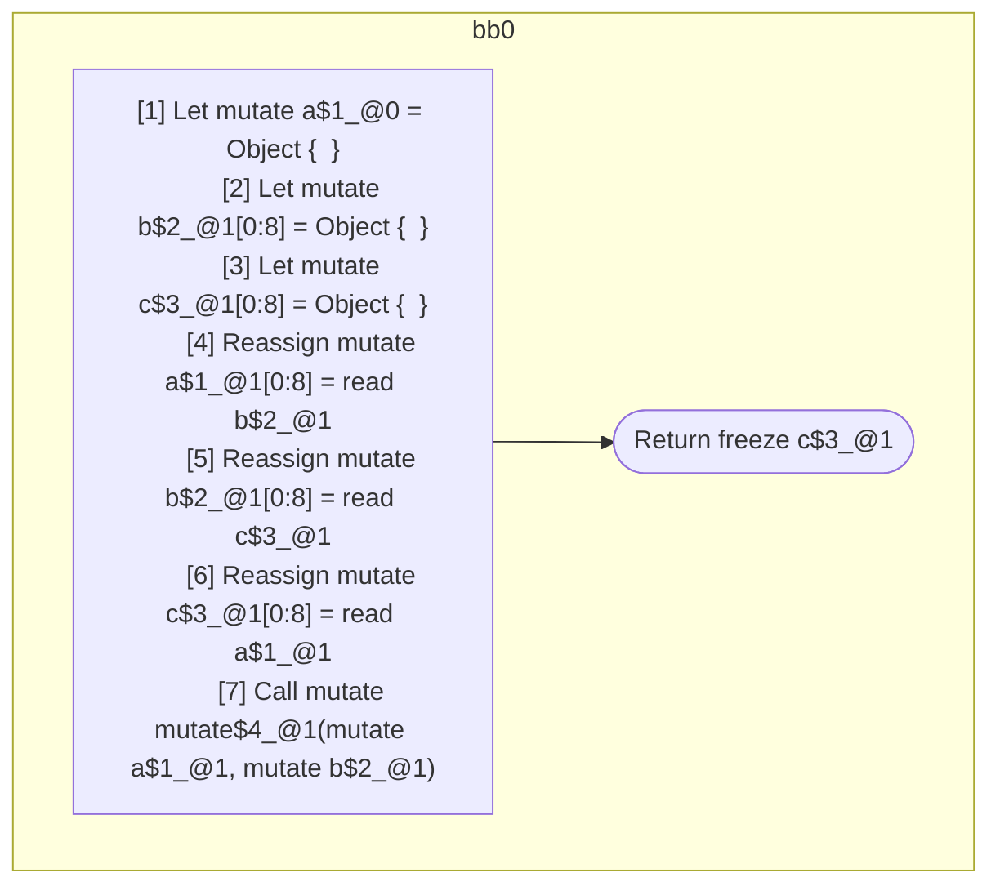

## Input

```javascript
function mutate() {}
function foo() {
  let a = {};
  let b = {};
  let c = {};
  a = b;
  b = c;
  c = a;
  mutate(a, b);
  return c;
}

```

## HIR

```
bb0:
  [1] Return
```

### CFG


## Code

```javascript
function mutate$0() {
  return;
}

```
## HIR

```
bb0:
  [1] Let mutate a$1_@0 = Object {  }
  [2] Let mutate b$2_@1[0:8] = Object {  }
  [3] Let mutate c$3_@1[0:8] = Object {  }
  [4] Reassign mutate a$1_@1[0:8] = read b$2_@1
  [5] Reassign mutate b$2_@1[0:8] = read c$3_@1
  [6] Reassign mutate c$3_@1[0:8] = read a$1_@1
  [7] Call mutate mutate$4_@1(mutate a$1_@1, mutate b$2_@1)
  [8] Return freeze c$3_@1
```

### CFG



## Code

```javascript
function foo$0() {
  let a$1 = {};
  let b$2 = {};
  let c$3 = {};
  a$1 = b$2;
  b$2 = c$3;
  c$3 = a$1;
  mutate$4(a$1, b$2);
  return c$3;
}

```
      