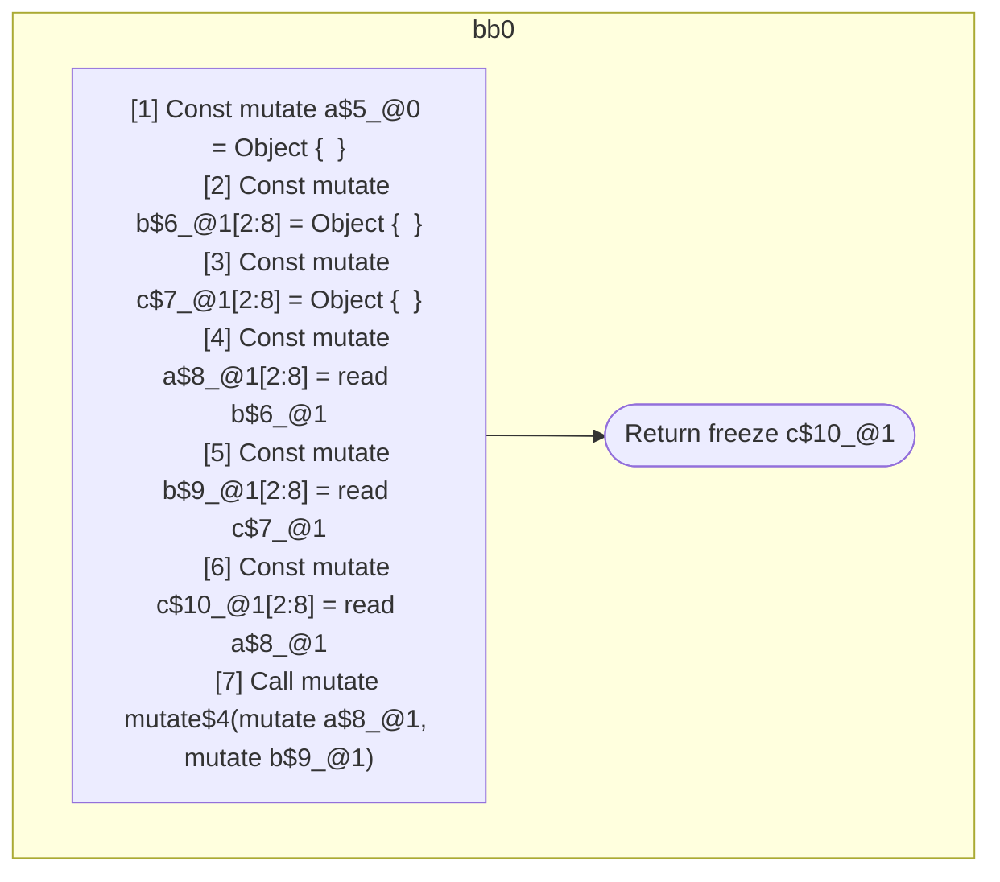

## Input

```javascript
function mutate() {}
function foo() {
  let a = {};
  let b = {};
  let c = {};
  a = b;
  b = c;
  c = a;
  mutate(a, b);
  return c;
}

```

## HIR

```
bb0:
  [1] Return

```

## Reactive Scopes

```
function mutate(
) {
  return
}

```

### CFG


## Code

```javascript
function mutate$0() {}

```
## HIR

```
bb0:
  [1] Const mutate a$5_@0 = Object {  }
  [2] Const mutate b$6_@1[2:8] = Object {  }
  [3] Const mutate c$7_@1[2:8] = Object {  }
  [4] Const mutate a$8_@1[2:8] = read b$6_@1
  [5] Const mutate b$9_@1[2:8] = read c$7_@1
  [6] Const mutate c$10_@1[2:8] = read a$8_@1
  [7] Call mutate mutate$4(mutate a$8_@1, mutate b$9_@1)
  [8] Return freeze c$10_@1

```

## Reactive Scopes

```
function foo(
) {
  scope @0 [1:2] deps=[] {
    [1] Const mutate a$5_@0 = Object {  }
  }
  scope @1 [2:8] deps=[] {
    [2] Const mutate b$6_@1[2:8] = Object {  }
    [3] Const mutate c$7_@1[2:8] = Object {  }
    [4] Const mutate a$8_@1[2:8] = read b$6_@1
    [5] Const mutate b$9_@1[2:8] = read c$7_@1
    [6] Const mutate c$10_@1[2:8] = read a$8_@1
    [7] Call mutate mutate$4(mutate a$8_@1, mutate b$9_@1)
  }
  return freeze c$10_@1
}

```

### CFG



## Code

```javascript
function foo$0() {
  const a$5 = {};
  const b$6 = {};
  const c$7 = {};
  const a$8 = b$6;
  const b$9 = c$7;
  const c$10 = a$8;
  mutate$4(a$8, b$9);
  return c$10;
}

```
      