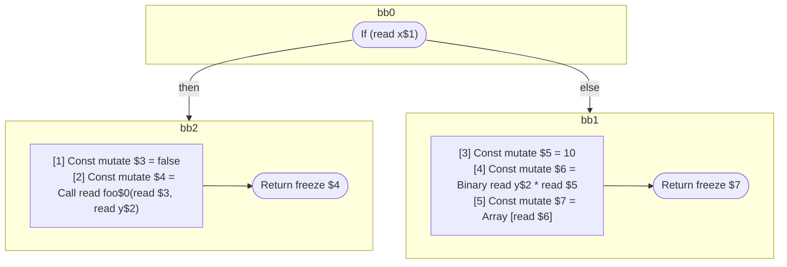

## Input

```javascript
function foo(x, y) {
  if (x) {
    return foo(false, y);
  }
  return [y * 10];
}

```

## HIR

```
bb0:
  If (read x$1) then:bb2 else:bb1
bb2:
  predecessor blocks: bb0
  [1] Const mutate $3 = false
  [2] Const mutate $4 = Call read foo$0(read $3, read y$2)
  Return freeze $4
bb1:
  predecessor blocks: bb0
  [3] Const mutate $5 = 10
  [4] Const mutate $6 = Binary read y$2 * read $5
  [5] Const mutate $7 = Array [read $6]
  Return freeze $7
```

### CFG



## Code

```javascript
function foo$0(x$1, y$2) {
  bb1: if (x$1) {
    return foo$0(false, y$2);
  }
  return [y$2 * 10];
}

```
      