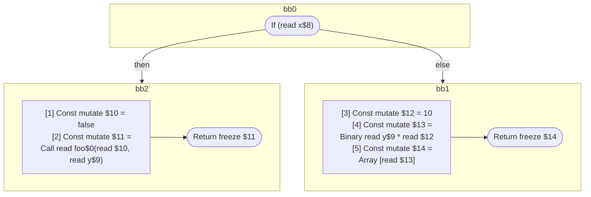

## Input

```javascript
function foo(x, y) {
  if (x) {
    return foo(false, y);
  }
  return [y * 10];
}

```

## HIR

```
bb0:
  If (read x$8) then:bb2 else:bb1
bb2:
  predecessor blocks: bb0
  [1] Const mutate $10 = false
  [2] Const mutate $11 = Call read foo$0(read $10, read y$9)
  Return freeze $11
bb1:
  predecessor blocks: bb0
  [3] Const mutate $12 = 10
  [4] Const mutate $13 = Binary read y$9 * read $12
  [5] Const mutate $14 = Array [read $13]
  Return freeze $14
```

### CFG



## Code

```javascript
function foo$0(x$8, y$9) {
  bb1: if (x$8) {
    return foo$0(false, y$9);
  }
  return [y$9 * 10];
}

```
      