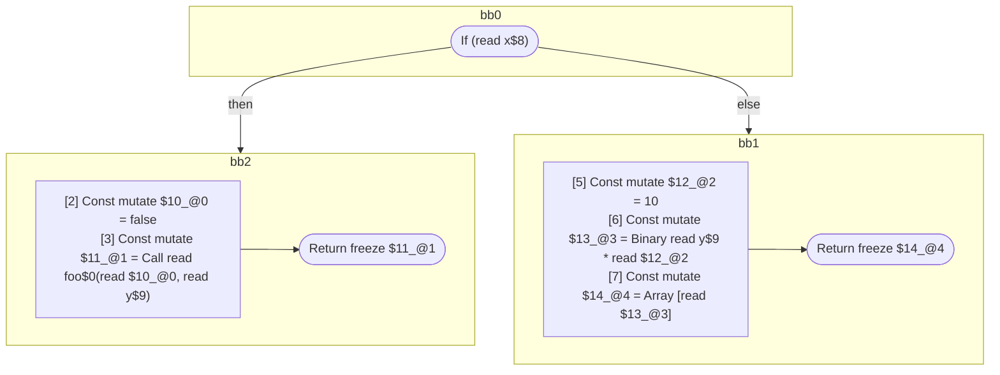

## Input

```javascript
function foo(x, y) {
  if (x) {
    return foo(false, y);
  }
  return [y * 10];
}

```

## HIR

```
bb0:
  [1] If (read x$8) then:bb2 else:bb1 fallthrough=bb1
bb2:
  predecessor blocks: bb0
  [2] Const mutate $10_@0 = false
  [3] Const mutate $11_@1 = Call read foo$0(read $10_@0, read y$9)
  [4] Return freeze $11_@1
bb1:
  predecessor blocks: bb0
  [5] Const mutate $12_@2 = 10
  [6] Const mutate $13_@3 = Binary read y$9 * read $12_@2
  [7] Const mutate $14_@4 = Array [read $13_@3]
  [8] Return freeze $14_@4
scope1 [3:4]:
  - dependency: read foo$0
  - dependency: read $10_@0
  - dependency: read y$9
scope3 [6:7]:
  - dependency: read y$9
  - dependency: read $12_@2
scope4 [7:8]:
  - dependency: read $13_@3
```

## Reactive Scopes

```
function foo(
  x,
  y,
) {
  if (read x$8) {
    [2] Const mutate $10_@0 = false
    scope @1 [3:4] deps=[read foo$0, read $10_@0, read y$9] {
      [3] Const mutate $11_@1 = Call read foo$0(read $10_@0, read y$9)
    }
    return freeze $11_@1
  }
  [5] Const mutate $12_@2 = 10
  [6] Const mutate $13_@3 = Binary read y$9 * read $12_@2
  scope @4 [7:8] deps=[read $13_@3] {
    [7] Const mutate $14_@4 = Array [read $13_@3]
  }
  return freeze $14_@4
}

```

### CFG



## Code

```javascript
function foo$0(x$8, y$9) {
  bb1: if (x$8) {
    return foo$0(false, y$9);
  }
  return [y$9 * 10];
}

```
      