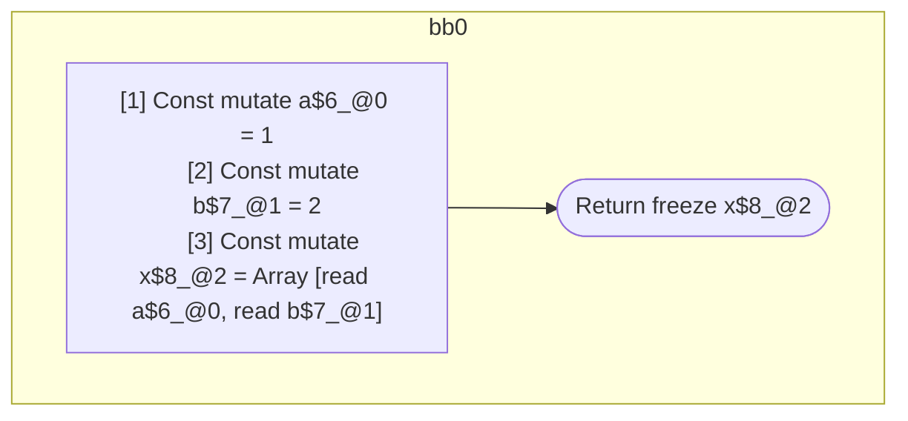

## Input

```javascript
function Component(props) {
  const a = 1;
  const b = 2;
  const x = [a, b];
  return x;
}

```

## HIR

```
bb0:
  [1] Const mutate a$6_@0 = 1
  [2] Const mutate b$7_@1 = 2
  [3] Const mutate x$8_@2 = Array [read a$6_@0, read b$7_@1]
  [4] Return freeze x$8_@2
scope2 [3:4]:
 - read a$6_@0
 - read b$7_@1
```

### CFG



## Code

```javascript
function Component$0(props$5) {
  const a$6 = 1;
  const b$7 = 2;
  const x$8 = [a$6, b$7];
  return x$8;
}

```
      