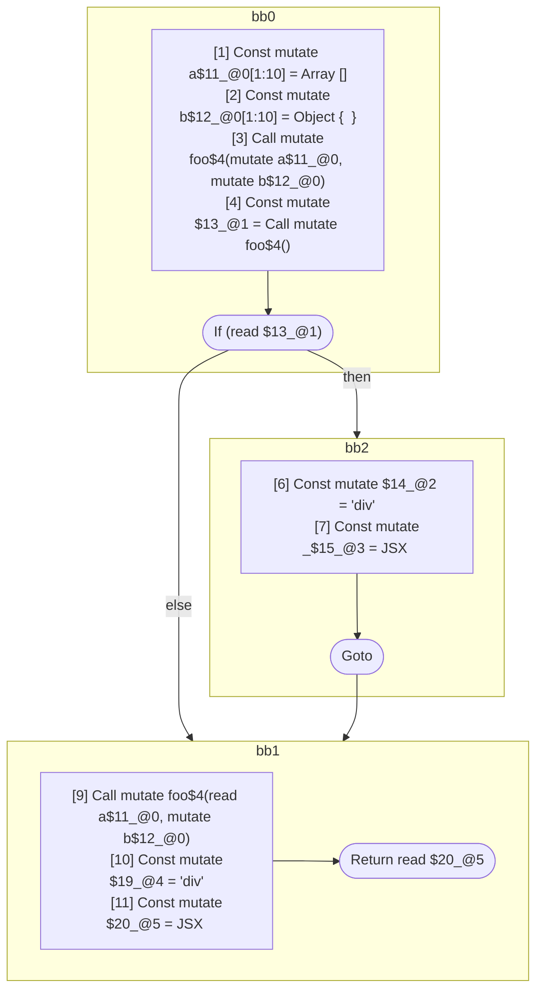

## Input

```javascript
// @Pass runMutableRangeAnalysis
function foo() {}

function Component(props) {
  const a = [];
  const b = {};
  foo(a, b);
  if (foo()) {
    let _ = <div a={a} />;
  }
  foo(a, b);
  return <div a={a} b={b} />;
}

```

## HIR

```
bb0:
  [1] Return

```

## Reactive Scopes

```
function foo(
) {
  return
}

```

### CFG


## Code

```javascript
function foo$0() {}

```
## HIR

```
bb0:
  [1] Const mutate a$11_@0[1:10] = Array []
  [2] Const mutate b$12_@0[1:10] = Object {  }
  [3] Call mutate foo$4(mutate a$11_@0, mutate b$12_@0)
  [4] Const mutate $13_@1 = Call mutate foo$4()
  [5] If (read $13_@1) then:bb2 else:bb1 fallthrough=bb1
bb2:
  predecessor blocks: bb0
  [6] Const mutate $14_@2 = "div"
  [7] Const mutate _$15_@3 = JSX <read $14_@2 a={freeze a$11_@0} ></read $14_@2>
  [8] Goto bb1
bb1:
  predecessor blocks: bb2 bb0
  [9] Call mutate foo$4(read a$11_@0, mutate b$12_@0)
  [10] Const mutate $19_@4 = "div"
  [11] Const mutate $20_@5 = JSX <read $19_@4 a={freeze a$11_@0} b={freeze b$12_@0} ></read $19_@4>
  [12] Return read $20_@5
scope3 [7:8]:
  - dependency: read $14_@2
scope5 [11:12]:
  - dependency: read $19_@4
  - dependency: freeze a$11_@0
  - dependency: freeze b$12_@0
```

## Reactive Scopes

```
function Component(
  props,
) {
  scope @0 [1:10] deps=[] {
    [1] Const mutate a$11_@0[1:10] = Array []
    [2] Const mutate b$12_@0[1:10] = Object {  }
    [3] Call mutate foo$4(mutate a$11_@0, mutate b$12_@0)
    scope @1 [4:5] deps=[] {
      [4] Const mutate $13_@1 = Call mutate foo$4()
    }
    if (read $13_@1) {
      [6] Const mutate $14_@2 = "div"
      scope @3 [7:8] deps=[read $14_@2] {
        [7] Const mutate _$15_@3 = JSX <read $14_@2 a={freeze a$11_@0} ></read $14_@2>
      }
    }
    [9] Call mutate foo$4(read a$11_@0, mutate b$12_@0)
  }
  [10] Const mutate $19_@4 = "div"
  scope @5 [11:12] deps=[read $19_@4, freeze a$11_@0, freeze b$12_@0] {
    [11] Const mutate $20_@5 = JSX <read $19_@4 a={freeze a$11_@0} b={freeze b$12_@0} ></read $19_@4>
  }
  return read $20_@5
}

```

### CFG



## Code

```javascript
function Component$0(props$10) {
  const a$11 = [];
  const b$12 = {};
  foo$4(a$11, b$12);
  bb1: if (foo$4()) {
    const _$15 = <div a={a$11}></div>;
  }

  foo$4(a$11, b$12);
  return <div a={a$11} b={b$12}></div>;
}

```
      