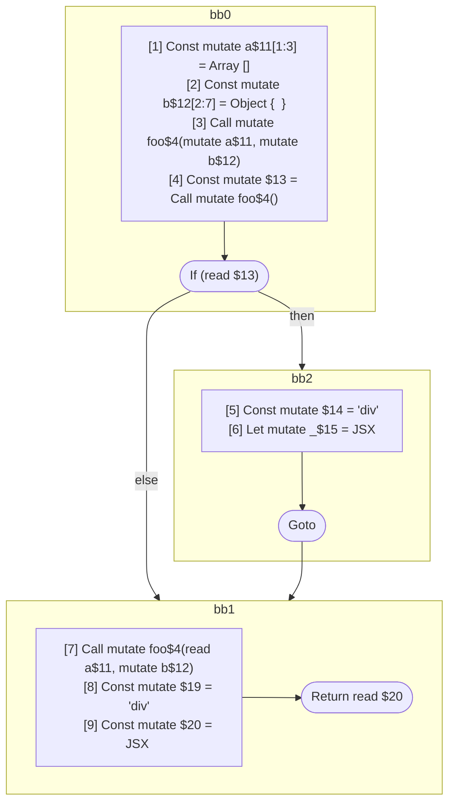

## Input

```javascript
// @Pass runMutableRangeAnalysis
function foo() {}

function Component(props) {
  const a = [];
  const b = {};
  foo(a, b);
  if (foo()) {
    let _ = <div a={a} />;
  }
  foo(a, b);
  return <div a={a} b={b} />;
}

```

## HIR

```
bb0:
  Return
```

### CFG


## Code

```javascript
function foo$0() {
  return;
}

```
## HIR

```
bb0:
  [1] Const mutate a$11[1:3] = Array []
  [2] Const mutate b$12[2:7] = Object {  }
  [3] Call mutate foo$4(mutate a$11, mutate b$12)
  [4] Const mutate $13 = Call mutate foo$4()
  If (read $13) then:bb2 else:bb1
bb2:
  predecessor blocks: bb0
  [5] Const mutate $14 = "div"
  [6] Let mutate _$15 = JSX <read $14 a={freeze a$11} ></read $14>
  Goto bb1
bb1:
  predecessor blocks: bb2 bb0
  [7] Call mutate foo$4(read a$11, mutate b$12)
  [8] Const mutate $19 = "div"
  [9] Const mutate $20 = JSX <read $19 a={freeze a$11} b={freeze b$12} ></read $19>
  Return read $20
```

### CFG



## Code

```javascript
function Component$0(props$10) {
  const a$11 = [];
  const b$12 = {};
  foo$4(a$11, b$12);
  bb1: if (foo$4()) {
    let _$15 = <div a={a$11}></div>;
  }

  foo$4(a$11, b$12);
  return <div a={a$11} b={b$12}></div>;
}

```
      