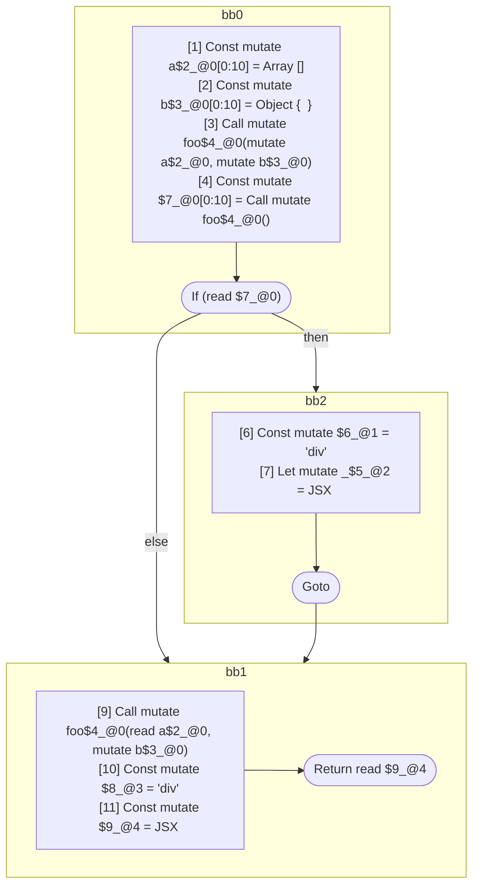

## Input

```javascript
// @Pass runMutableRangeAnalysis
function foo() {}

function Component(props) {
  const a = [];
  const b = {};
  foo(a, b);
  if (foo()) {
    let _ = <div a={a} />;
  }
  foo(a, b);
  return <div a={a} b={b} />;
}

```

## HIR

```
bb0:
  [1] Return
```

### CFG


## Code

```javascript
function foo$0() {
  return;
}

```
## HIR

```
bb0:
  [1] Const mutate a$2_@0[0:10] = Array []
  [2] Const mutate b$3_@0[0:10] = Object {  }
  [3] Call mutate foo$4_@0(mutate a$2_@0, mutate b$3_@0)
  [4] Const mutate $7_@0[0:10] = Call mutate foo$4_@0()
  [5] If (read $7_@0) then:bb2 else:bb1
bb2:
  predecessor blocks: bb0
  [6] Const mutate $6_@1 = "div"
  [7] Let mutate _$5_@2 = JSX <read $6_@1 a={freeze a$2_@0} ></read $6_@1>
  [8] Goto bb1
bb1:
  predecessor blocks: bb2 bb0
  [9] Call mutate foo$4_@0(read a$2_@0, mutate b$3_@0)
  [10] Const mutate $8_@3 = "div"
  [11] Const mutate $9_@4 = JSX <read $8_@3 a={freeze a$2_@0} b={freeze b$3_@0} ></read $8_@3>
  [12] Return read $9_@4
```

### CFG



## Code

```javascript
function Component$0(props$1) {
  const a$2 = [];
  const b$3 = {};
  foo$4(a$2, b$3);
  bb1: if (foo$4()) {
    let _$5 = <div a={a$2}></div>;
  }

  foo$4(a$2, b$3);
  return <div a={a$2} b={b$3}></div>;
}

```
      