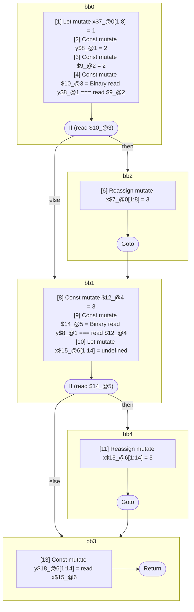

## Input

```javascript
function foo() {
  let x = 1;
  let y = 2;
  if (y === 2) {
    x = 3;
  }

  if (y === 3) {
    x = 5;
  }
  y = x;
}

```

## HIR

```
bb0:
  [1] Let mutate x$7_@0[1:8] = 1
  [2] Const mutate y$8_@1 = 2
  [3] Const mutate $9_@2 = 2
  [4] Const mutate $10_@3 = Binary read y$8_@1 === read $9_@2
  [5] If (read $10_@3) then:bb2 else:bb1 fallthrough=bb1
bb2:
  predecessor blocks: bb0
  [6] Reassign mutate x$7_@0[1:8] = 3
  [7] Goto bb1
bb1:
  predecessor blocks: bb2 bb0
  [8] Const mutate $12_@4 = 3
  [9] Const mutate $14_@5 = Binary read y$8_@1 === read $12_@4
  [10] Let mutate x$15_@6[1:14] = undefined
  [10] If (read $14_@5) then:bb4 else:bb3 fallthrough=bb3
bb4:
  predecessor blocks: bb1
  [11] Reassign mutate x$15_@6[1:14] = 5
  [12] Goto bb3
bb3:
  predecessor blocks: bb4 bb1
  [13] Const mutate y$18_@6[1:14] = read x$15_@6
  [14] Return
scope3 [4:5]:
 - read y$8_@1
 - read $9_@2
scope5 [9:10]:
 - read y$8_@1
 - read $12_@4
```

### CFG



## Code

```javascript
function foo$0() {
  let x$7 = 1;
  const y$8 = 2;
  bb1: if (y$8 === 2) {
    x$7 = 3;
  }

  let x$15 = undefined;

  bb3: if (y$8 === 3) {
    x$15 = 5;
  }

  const y$18 = x$15;
}

```
      