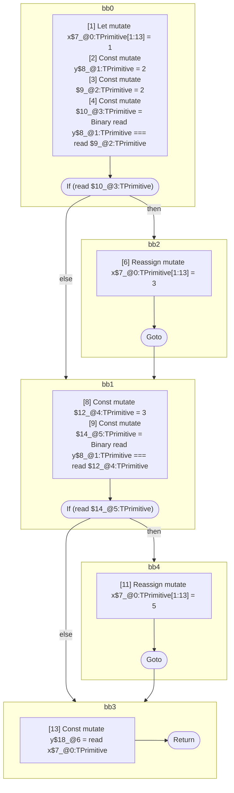

## Input

```javascript
function foo() {
  let x = 1;
  let y = 2;
  if (y === 2) {
    x = 3;
  }

  if (y === 3) {
    x = 5;
  }
  y = x;
}

```

## HIR

```
bb0:
  [1] Let mutate x$7_@0:TPrimitive[1:13] = 1
  [2] Const mutate y$8_@1:TPrimitive = 2
  [3] Const mutate $9_@2:TPrimitive = 2
  [4] Const mutate $10_@3:TPrimitive = Binary read y$8_@1:TPrimitive === read $9_@2:TPrimitive
  [5] If (read $10_@3:TPrimitive) then:bb2 else:bb1 fallthrough=bb1
bb2:
  predecessor blocks: bb0
  [6] Reassign mutate x$7_@0:TPrimitive[1:13] = 3
  [7] Goto bb1
bb1:
  predecessor blocks: bb2 bb0
  [8] Const mutate $12_@4:TPrimitive = 3
  [9] Const mutate $14_@5:TPrimitive = Binary read y$8_@1:TPrimitive === read $12_@4:TPrimitive
  [10] If (read $14_@5:TPrimitive) then:bb4 else:bb3 fallthrough=bb3
bb4:
  predecessor blocks: bb1
  [11] Reassign mutate x$7_@0:TPrimitive[1:13] = 5
  [12] Goto bb3
bb3:
  predecessor blocks: bb4 bb1
  [13] Const mutate y$18_@6 = read x$7_@0:TPrimitive
  [14] Return
scope3 [4:5]:
  - dependency: read y$8_@1:TPrimitive
  - dependency: read $9_@2:TPrimitive
scope5 [9:10]:
  - dependency: read y$8_@1:TPrimitive
  - dependency: read $12_@4:TPrimitive
scope6 [13:14]:
  - dependency: read x$7_@0:TPrimitive
```

## Reactive Scopes

```
function foo(
) {
  scope @0 [1:13] deps=[] {
    [1] Let mutate x$7_@0:TPrimitive[1:13] = 1
    [2] Const mutate y$8_@1:TPrimitive = 2
    [3] Const mutate $9_@2:TPrimitive = 2
    [4] Const mutate $10_@3:TPrimitive = Binary read y$8_@1:TPrimitive === read $9_@2:TPrimitive
    if (read $10_@3:TPrimitive) {
      [6] Reassign mutate x$7_@0:TPrimitive[1:13] = 3
    }
    [8] Const mutate $12_@4:TPrimitive = 3
    [9] Const mutate $14_@5:TPrimitive = Binary read y$8_@1:TPrimitive === read $12_@4:TPrimitive
    if (read $14_@5:TPrimitive) {
      [11] Reassign mutate x$7_@0:TPrimitive[1:13] = 5
    }
  }
  [13] Const mutate y$18_@6 = read x$7_@0:TPrimitive
  return
}

```

### CFG



## Code

```javascript
function foo$0() {
  let x$7 = 1;
  const y$8 = 2;
  bb1: if (y$8 === 2) {
    x$7 = 3;
  }

  bb3: if (y$8 === 3) {
    x$7 = 5;
  }

  const y$18 = x$7;
}

```
      