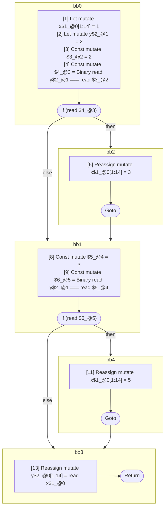

## Input

```javascript
function foo() {
  let x = 1;
  let y = 2;
  if (y === 2) {
    x = 3;
  }

  if (y === 3) {
    x = 5;
  }
  y = x;
}

```

## HIR

```
bb0:
  [1] Let mutate x$1_@0[1:14] = 1
  [2] Let mutate y$2_@1 = 2
  [3] Const mutate $3_@2 = 2
  [4] Const mutate $4_@3 = Binary read y$2_@1 === read $3_@2
  [5] If (read $4_@3) then:bb2 else:bb1
bb2:
  predecessor blocks: bb0
  [6] Reassign mutate x$1_@0[1:14] = 3
  [7] Goto bb1
bb1:
  predecessor blocks: bb2 bb0
  [8] Const mutate $5_@4 = 3
  [9] Const mutate $6_@5 = Binary read y$2_@1 === read $5_@4
  [10] If (read $6_@5) then:bb4 else:bb3
bb4:
  predecessor blocks: bb1
  [11] Reassign mutate x$1_@0[1:14] = 5
  [12] Goto bb3
bb3:
  predecessor blocks: bb4 bb1
  [13] Reassign mutate y$2_@0[1:14] = read x$1_@0
  [14] Return
```

### CFG



## Code

```javascript
function foo$0() {
  let x$1 = 1;
  let y$2 = 2;
  bb1: if (y$2 === 2) {
    x$1 = 3;
  }

  bb3: if (y$2 === 3) {
    x$1 = 5;
  }

  y$2 = x$1;
  return;
}

```
      