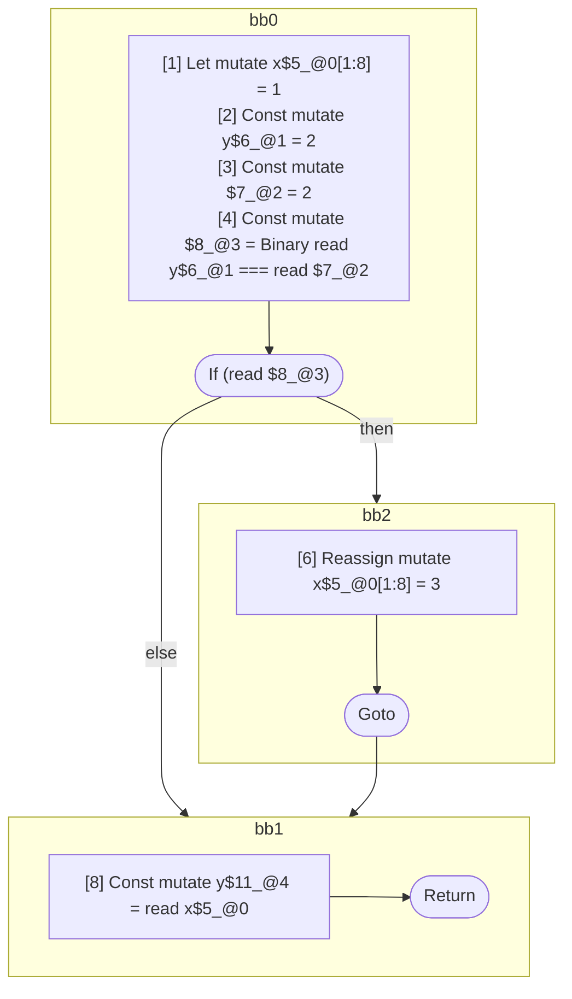

## Input

```javascript
function foo() {
  let x = 1;
  let y = 2;
  if (y === 2) {
    x = 3;
  }

  y = x;
}

```

## HIR

```
bb0:
  [1] Let mutate x$5_@0[1:8] = 1
  [2] Const mutate y$6_@1 = 2
  [3] Const mutate $7_@2 = 2
  [4] Const mutate $8_@3 = Binary read y$6_@1 === read $7_@2
  [5] If (read $8_@3) then:bb2 else:bb1 fallthrough=bb1
bb2:
  predecessor blocks: bb0
  [6] Reassign mutate x$5_@0[1:8] = 3
  [7] Goto bb1
bb1:
  predecessor blocks: bb2 bb0
  [8] Const mutate y$11_@4 = read x$5_@0
  [9] Return
scope3 [4:5]:
  - dependency: read y$6_@1
  - dependency: read $7_@2
scope4 [8:9]:
  - dependency: read x$5_@0
```

### CFG



## Code

```javascript
function foo$0() {
  let x$5 = 1;
  const y$6 = 2;
  bb1: if (y$6 === 2) {
    x$5 = 3;
  }

  const y$11 = x$5;
}

```
      