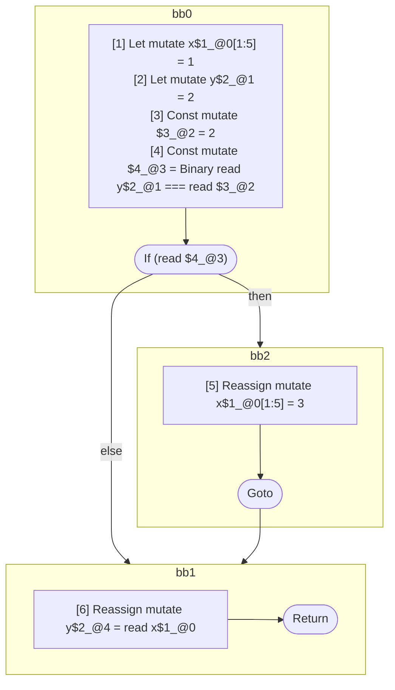

## Input

```javascript
function foo() {
  let x = 1;
  let y = 2;
  if (y === 2) {
    x = 3;
  }

  y = x;
}

```

## HIR

```
bb0:
  [1] Let mutate x$1_@0[1:5] = 1
  [2] Let mutate y$2_@1 = 2
  [3] Const mutate $3_@2 = 2
  [4] Const mutate $4_@3 = Binary read y$2_@1 === read $3_@2
  If (read $4_@3) then:bb2 else:bb1
bb2:
  predecessor blocks: bb0
  [5] Reassign mutate x$1_@0[1:5] = 3
  Goto bb1
bb1:
  predecessor blocks: bb2 bb0
  [6] Reassign mutate y$2_@4 = read x$1_@0
  Return
```

### CFG



## Code

```javascript
function foo$0() {
  let x$1 = 1;
  let y$2 = 2;
  bb1: if (y$2 === 2) {
    x$1 = 3;
  }

  y$2 = x$1;
  return;
}

```
      