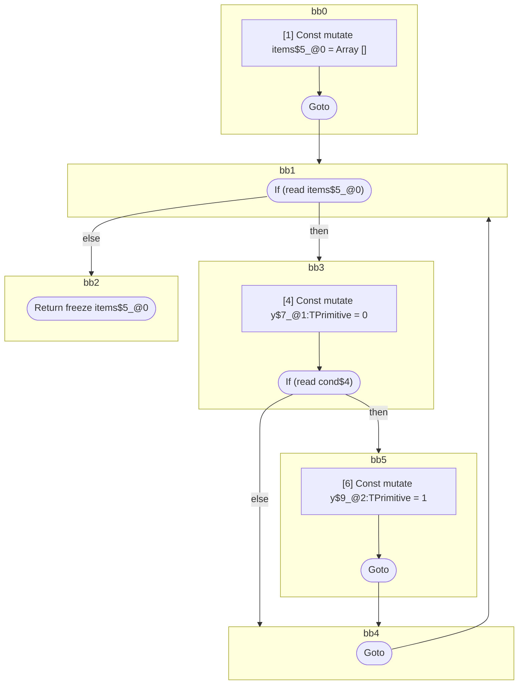

## Input

```javascript
function foo(cond) {
  let items = [];
  for (const item of items) {
    let y = 0;
    if (cond) {
      y = 1;
    }
  }
  return items;
}

```

## HIR

```
bb0:
  [1] Const mutate items$5_@0 = Array []
  [2] Goto bb1
bb1:
  predecessor blocks: bb0 bb4
  [3] If (read items$5_@0) then:bb3 else:bb2 fallthrough=bb2
bb3:
  predecessor blocks: bb1
  [4] Const mutate y$7_@1:TPrimitive = 0
  [5] If (read cond$4) then:bb5 else:bb4 fallthrough=bb4
bb5:
  predecessor blocks: bb3
  [6] Const mutate y$9_@2:TPrimitive = 1
  [7] Goto bb4
bb4:
  predecessor blocks: bb5 bb3
  [8] Goto(Continue) bb1
bb2:
  predecessor blocks: bb1
  [9] Return freeze items$5_@0

```

## Reactive Scopes

```
function foo(
  cond,
) {
  scope @0 [1:2] deps=[] {
    [1] Const mutate items$5_@0 = Array []
  }
}

```

### CFG



## Code

```javascript
function foo$0(cond$4) {
  const items$5 = [];
}

```
      