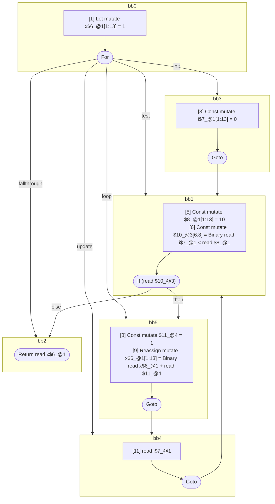

## Input

```javascript
function foo() {
  let x = 1;
  for (let i = 0; i < 10; /* update is intentally a single identifier */ i) {
    x += 1;
  }
  return x;
}

```

## HIR

```
bb0:
  [1] Let mutate x$6_@1[1:13] = 1
  [2] For init=bb3 test=bb1 loop=bb5 update=bb4 fallthrough=bb2
bb3:
  predecessor blocks: bb0
  [3] Const mutate i$7_@1[1:13] = 0
  [4] Goto bb1
bb1:
  predecessor blocks: bb3 bb4
  [5] Const mutate $8_@1[1:13] = 10
  [6] Const mutate $10_@3[6:8] = Binary read i$7_@1 < read $8_@1
  [7] If (read $10_@3) then:bb5 else:bb2 fallthrough=bb2
bb5:
  predecessor blocks: bb1
  [8] Const mutate $11_@4 = 1
  [9] Reassign mutate x$6_@1[1:13] = Binary read x$6_@1 + read $11_@4
  [10] Goto(Continue) bb4
bb4:
  predecessor blocks: bb5
  [11] read i$7_@1
  [12] Goto bb1
bb2:
  predecessor blocks: bb1
  [13] Return read x$6_@1

```

### CFG



## Code

```javascript
function foo$0() {
  let x$6 = 1;
  bb2: for (const i$7 = 0; i$7 < 10; i$7) {
    x$6 = x$6 + 1;
  }

  return x$6;
}

```
      