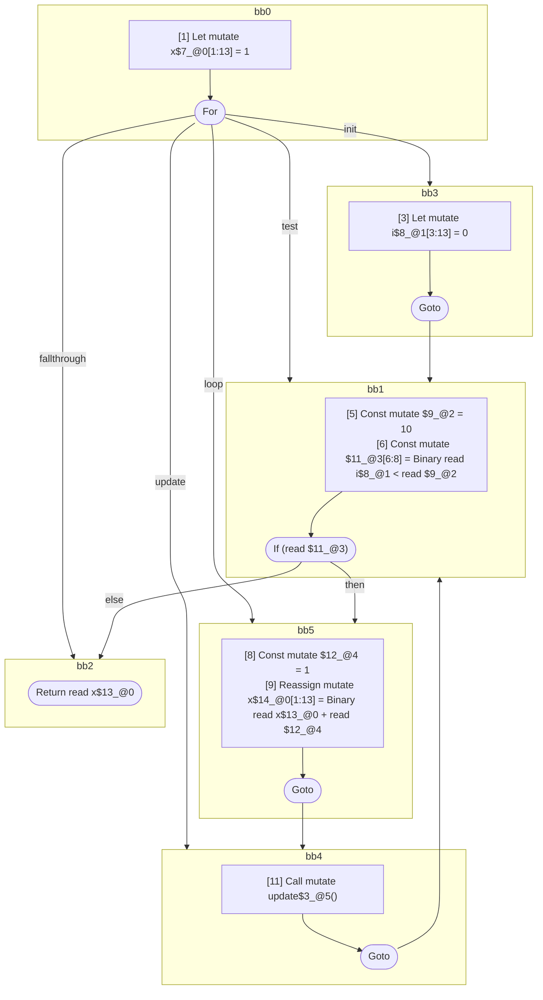

## Input

```javascript
function foo() {
  let x = 1;
  for (let i = 0; i < 10; update()) {
    x += 1;
  }
  return x;
}

```

## HIR

```
bb0:
  [1] Let mutate x$7_@0[1:13] = 1
  [2] For init=bb3 test=bb1 loop=bb5 update=bb4 fallthrough=bb2
bb3:
  predecessor blocks: bb0
  [3] Let mutate i$8_@1[3:13] = 0
  [4] Goto bb1
bb1:
  predecessor blocks: bb3 bb4
  x$13_@0[1:13]: phi(bb3: x$7_@0, bb4: x$14_@0)
  [5] Const mutate $9_@2 = 10
  [6] Const mutate $11_@3[6:8] = Binary read i$8_@1 < read $9_@2
  [7] If (read $11_@3) then:bb5 else:bb2 fallthrough=bb2
bb5:
  predecessor blocks: bb1
  [8] Const mutate $12_@4 = 1
  [9] Reassign mutate x$14_@0[1:13] = Binary read x$13_@0 + read $12_@4
  [10] Goto(Continue) bb4
bb4:
  predecessor blocks: bb5
  [11] Call mutate update$3_@5()
  [12] Goto bb1
bb2:
  predecessor blocks: bb1
  [13] Return read x$13_@0
scope3 [6:8]:
 - read $9_@2
```

### CFG



## Code

```javascript
function foo$0() {
  let x$7 = 1;
  bb2: for (const i$8 = 0; i$8 < 10; update$3()) {
    x$7 = x$7 + 1;
  }

  return x$7;
}

```
      