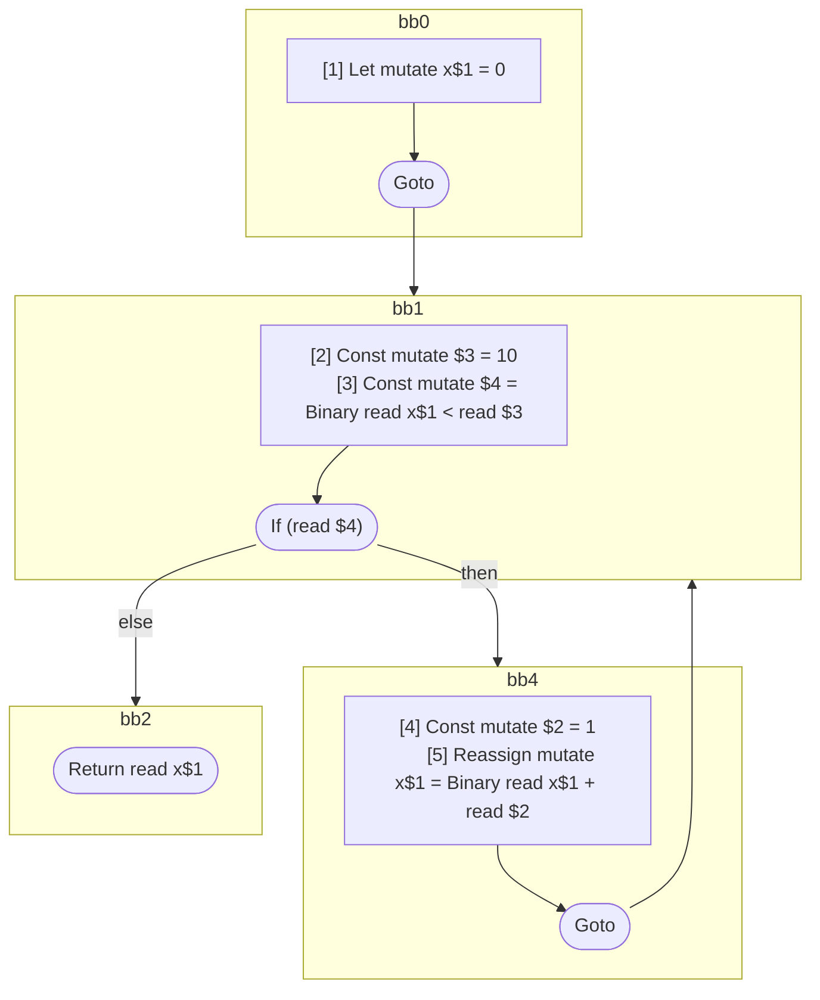

## Input

```javascript
function foo() {
  let x = 0;
  for (; x < 10; ) {
    x = x + 1;
  }
  return x;
}

```

## HIR

```
bb0:
  [1] Let mutate x$1 = 0
  Goto bb1
bb1:
  predecessor blocks: bb0 bb4
  [2] Const mutate $3 = 10
  [3] Const mutate $4 = Binary read x$1 < read $3
  If (read $4) then:bb4 else:bb2
bb4:
  predecessor blocks: bb1
  [4] Const mutate $2 = 1
  [5] Reassign mutate x$1 = Binary read x$1 + read $2
  Goto(Continue) bb1
bb2:
  predecessor blocks: bb1
  Return read x$1
```

### CFG



## Code

```javascript
function foo$0() {
  let x$1 = 0;
}

```
      