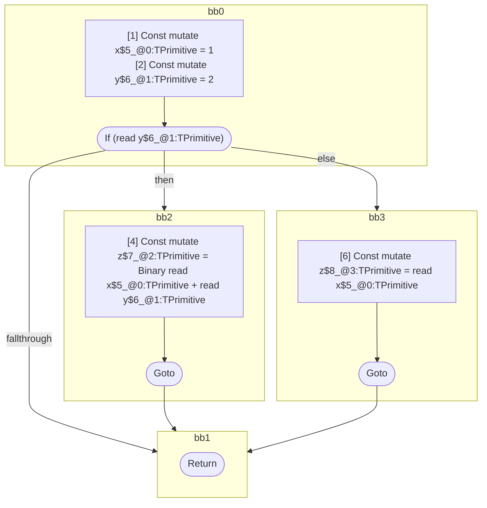

## Input

```javascript
function foo() {
  let x = 1;
  let y = 2;

  if (y) {
    let z = x + y;
  } else {
    let z = x;
  }
}

```

## HIR

```
bb0:
  [1] Const mutate x$5_@0:TPrimitive = 1
  [2] Const mutate y$6_@1:TPrimitive = 2
  [3] If (read y$6_@1:TPrimitive) then:bb2 else:bb3 fallthrough=bb1
bb2:
  predecessor blocks: bb0
  [4] Const mutate z$7_@2:TPrimitive = Binary read x$5_@0:TPrimitive + read y$6_@1:TPrimitive
  [5] Goto bb1
bb3:
  predecessor blocks: bb0
  [6] Const mutate z$8_@3:TPrimitive = read x$5_@0:TPrimitive
  [7] Goto bb1
bb1:
  predecessor blocks: bb2 bb3
  [8] Return
scope2 [4:5]:
  - dependency: read x$5_@0:TPrimitive
  - dependency: read y$6_@1:TPrimitive
scope3 [6:7]:
  - dependency: read x$5_@0:TPrimitive
```

## Reactive Scopes

```
function foo(
) {
  [1] Const mutate x$5_@0:TPrimitive = 1
  [2] Const mutate y$6_@1:TPrimitive = 2
  if (read y$6_@1:TPrimitive) {
    [4] Const mutate z$7_@2:TPrimitive = Binary read x$5_@0:TPrimitive + read y$6_@1:TPrimitive
  } else {
    [6] Const mutate z$8_@3:TPrimitive = read x$5_@0:TPrimitive
  }
  return
}

```

### CFG



## Code

```javascript
function foo$0() {
  const x$5 = 1;
  const y$6 = 2;
  bb1: if (y$6) {
    const z$7 = x$5 + y$6;
  } else {
    const z$8 = x$5;
  }
}

```
      