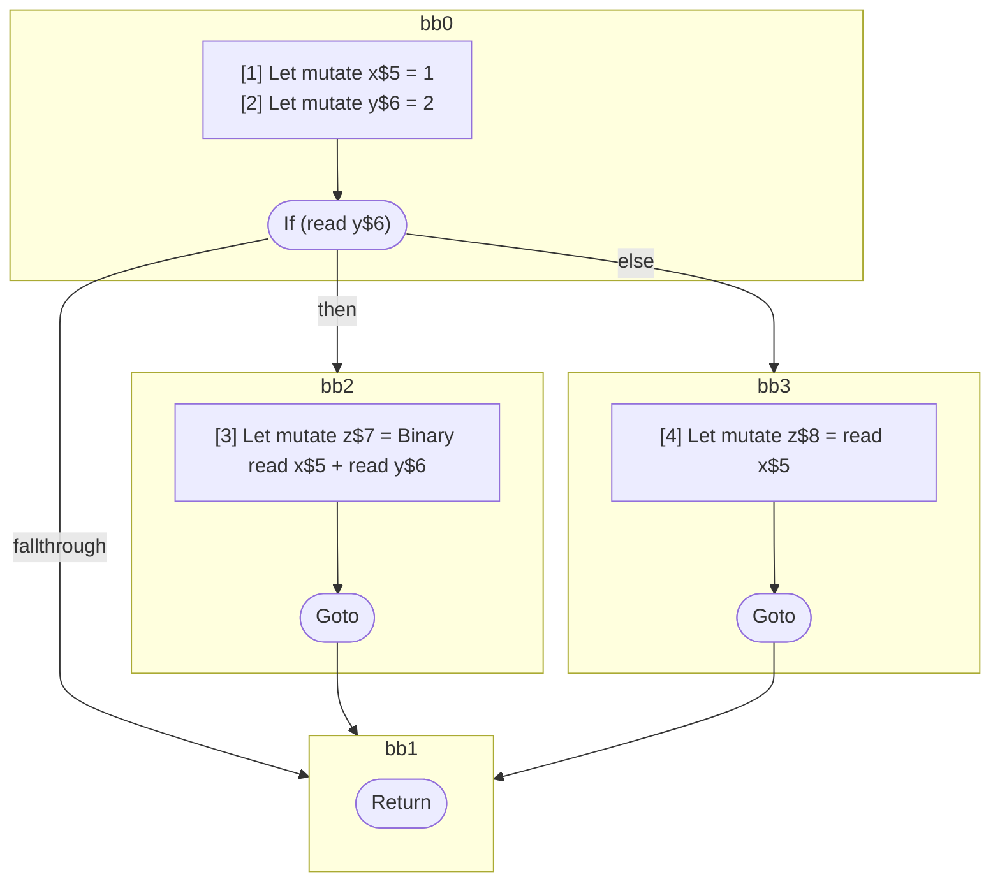

## Input

```javascript
function foo() {
  let x = 1;
  let y = 2;

  if (y) {
    let z = x + y;
  } else {
    let z = x;
  }
}

```

## HIR

```
bb0:
  [1] Let mutate x$5 = 1
  [2] Let mutate y$6 = 2
  If (read y$6) then:bb2 else:bb3
bb2:
  predecessor blocks: bb0
  [3] Let mutate z$7 = Binary read x$5 + read y$6
  Goto bb1
bb3:
  predecessor blocks: bb0
  [4] Let mutate z$8 = read x$5
  Goto bb1
bb1:
  predecessor blocks: bb2 bb3
  Return
```

### CFG



## Code

```javascript
function foo$0() {
  let x$5 = 1;
  let y$6 = 2;
  bb1: if (y$6) {
    let z$7 = x$5 + y$6;
  } else {
    let z$8 = x$5;
  }

  return;
}

```
      