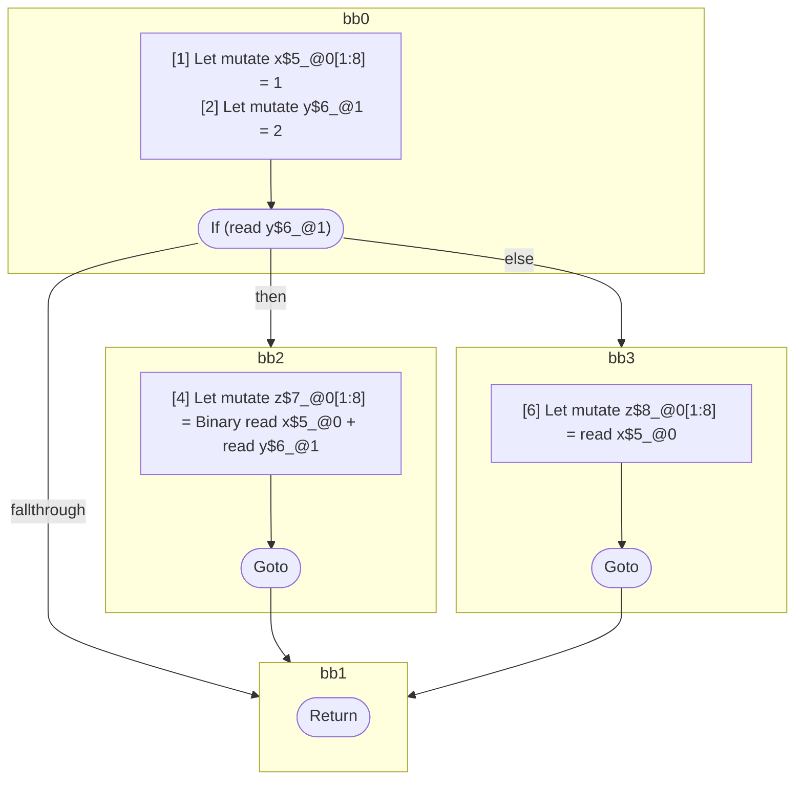

## Input

```javascript
function foo() {
  let x = 1;
  let y = 2;

  if (y) {
    let z = x + y;
  } else {
    let z = x;
  }
}

```

## HIR

```
bb0:
  [1] Let mutate x$5_@0[1:8] = 1
  [2] Let mutate y$6_@1 = 2
  [3] If (read y$6_@1) then:bb2 else:bb3
bb2:
  predecessor blocks: bb0
  [4] Let mutate z$7_@0[1:8] = Binary read x$5_@0 + read y$6_@1
  [5] Goto bb1
bb3:
  predecessor blocks: bb0
  [6] Let mutate z$8_@0[1:8] = read x$5_@0
  [7] Goto bb1
bb1:
  predecessor blocks: bb2 bb3
  [8] Return
```

### CFG



## Code

```javascript
function foo$0() {
  let x$1 = 1;
  let y$2 = 2;
  bb1: if (y$2) {
    let z$3 = x$1 + y$2;
  } else {
    let z$4 = x$1;
  }
}

```
      