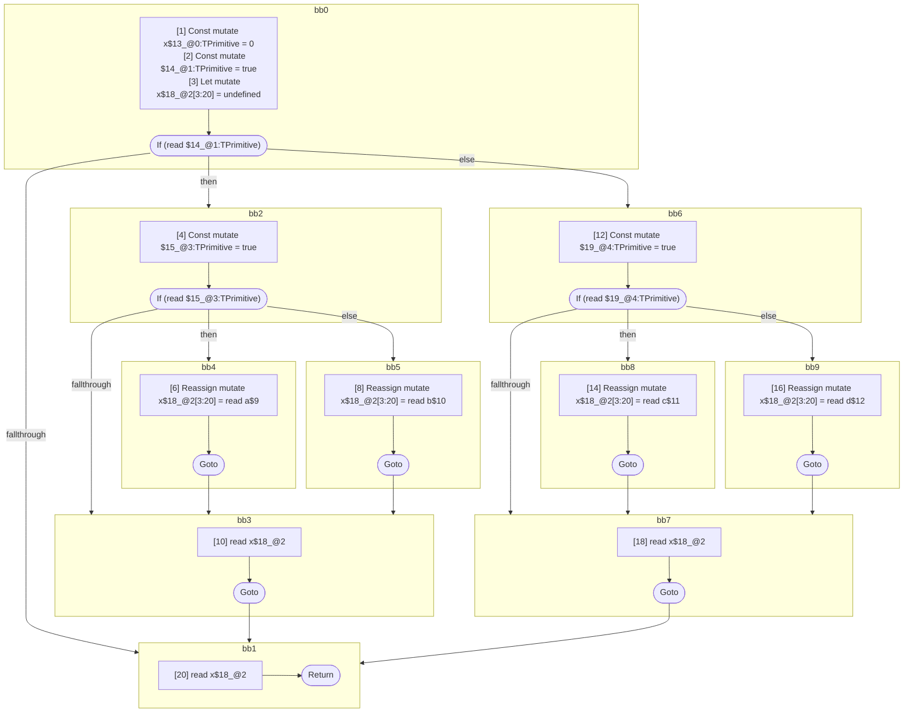

## Input

```javascript
function foo(a, b, c, d) {
  let x = 0;
  if (true) {
    if (true) {
      x = a;
    } else {
      x = b;
    }
    x;
  } else {
    if (true) {
      x = c;
    } else {
      x = d;
    }
    x;
  }
  x;
}

```

## HIR

```
bb0:
  [1] Const mutate x$13_@0:TPrimitive = 0
  [2] Const mutate $14_@1:TPrimitive = true
  [3] Let mutate x$18_@2[3:20] = undefined
  [3] If (read $14_@1:TPrimitive) then:bb2 else:bb6 fallthrough=bb1
bb2:
  predecessor blocks: bb0
  [4] Const mutate $15_@3:TPrimitive = true
  [5] If (read $15_@3:TPrimitive) then:bb4 else:bb5 fallthrough=bb3
bb4:
  predecessor blocks: bb2
  [6] Reassign mutate x$18_@2[3:20] = read a$9
  [7] Goto bb3
bb5:
  predecessor blocks: bb2
  [8] Reassign mutate x$18_@2[3:20] = read b$10
  [9] Goto bb3
bb3:
  predecessor blocks: bb4 bb5
  [10] read x$18_@2
  [11] Goto bb1
bb6:
  predecessor blocks: bb0
  [12] Const mutate $19_@4:TPrimitive = true
  [13] If (read $19_@4:TPrimitive) then:bb8 else:bb9 fallthrough=bb7
bb8:
  predecessor blocks: bb6
  [14] Reassign mutate x$18_@2[3:20] = read c$11
  [15] Goto bb7
bb9:
  predecessor blocks: bb6
  [16] Reassign mutate x$18_@2[3:20] = read d$12
  [17] Goto bb7
bb7:
  predecessor blocks: bb8 bb9
  [18] read x$18_@2
  [19] Goto bb1
bb1:
  predecessor blocks: bb3 bb7
  [20] read x$18_@2
  [21] Return
scope2 [3:20]:
  - dependency: read a$9
  - dependency: read b$10
  - dependency: read c$11
  - dependency: read d$12
  - dependency: read $14_@1:TPrimitive
```

## Reactive Scopes

```
function foo(
  a,
  b,
  c,
  d,
) {
  [1] Const mutate x$13_@0:TPrimitive = 0
  [2] Const mutate $14_@1:TPrimitive = true
  scope @2 [3:20] deps=[read a$9, read b$10, read c$11, read d$12, read $14_@1:TPrimitive] {
    [3] Let mutate x$18_@2[3:20] = undefined
    if (read $14_@1:TPrimitive) {
      [4] Const mutate $15_@3:TPrimitive = true
      if (read $15_@3:TPrimitive) {
        [6] Reassign mutate x$18_@2[3:20] = read a$9
      } else {
        [8] Reassign mutate x$18_@2[3:20] = read b$10
      }
      [10] read x$18_@2
    } else {
      [12] Const mutate $19_@4:TPrimitive = true
      if (read $19_@4:TPrimitive) {
        [14] Reassign mutate x$18_@2[3:20] = read c$11
      } else {
        [16] Reassign mutate x$18_@2[3:20] = read d$12
      }
      [18] read x$18_@2
    }
  }
  [20] read x$18_@2
  return
}

```

### CFG



## Code

```javascript
function foo$0(a$9, b$10, c$11, d$12) {
  const x$13 = 0;
  let x$18 = undefined;
  bb1: if (true) {
    bb3: if (true) {
      x$18 = a$9;
    } else {
      x$18 = b$10;
    }

    x$18;
  } else {
    bb7: if (true) {
      x$18 = c$11;
    } else {
      x$18 = d$12;
    }

    x$18;
  }

  x$18;
}

```
      