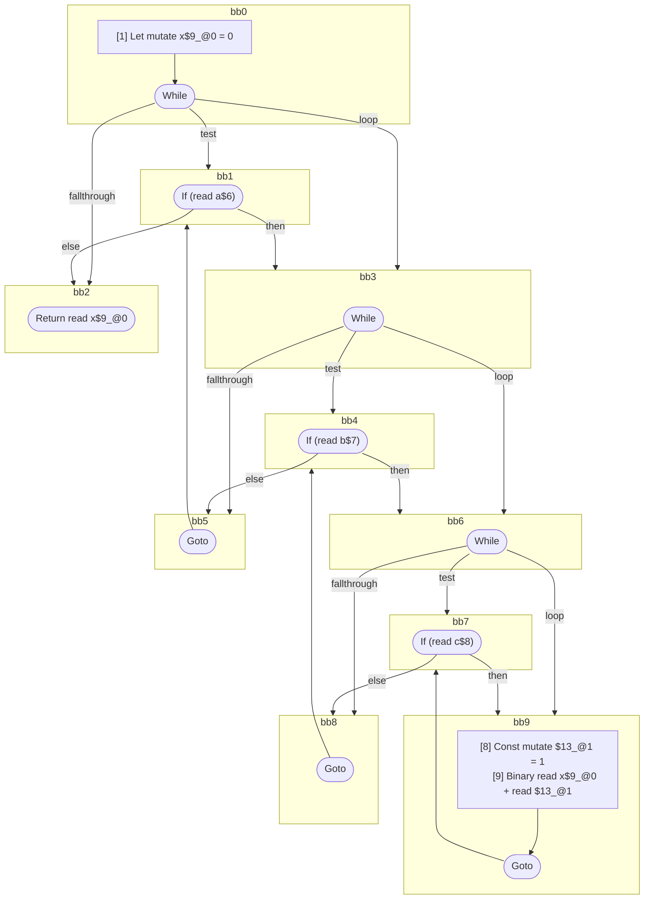

## Input

```javascript
// @xonly
function foo(a, b, c) {
  let x = 0;
  while (a) {
    while (b) {
      while (c) {
        x + 1;
      }
    }
  }
  return x;
}

```

## HIR

```
bb0:
  [1] Let mutate x$9_@0 = 0
  [2] While test=bb1 loop=bb3 fallthrough=bb2
bb1:
  predecessor blocks: bb0 bb5
  [3] If (read a$6) then:bb3 else:bb2
bb3:
  predecessor blocks: bb1
  [4] While test=bb4 loop=bb6 fallthrough=bb5
bb4:
  predecessor blocks: bb3 bb8
  [5] If (read b$7) then:bb6 else:bb5
bb6:
  predecessor blocks: bb4
  [6] While test=bb7 loop=bb9 fallthrough=bb8
bb7:
  predecessor blocks: bb6 bb9
  [7] If (read c$8) then:bb9 else:bb8
bb9:
  predecessor blocks: bb7
  [8] Const mutate $13_@1 = 1
  [9] Binary read x$9_@0 + read $13_@1
  [10] Goto(Continue) bb7
bb8:
  predecessor blocks: bb7
  [11] Goto(Continue) bb4
bb5:
  predecessor blocks: bb4
  [12] Goto(Continue) bb1
bb2:
  predecessor blocks: bb1
  [13] Return read x$9_@0
scope1 [8:9]:
 - read x$9_@0
```

### CFG



## Code

```javascript
function foo$0(a$1, b$2, c$3) {
  let x$4 = 0;
  bb2: while (a$1) {
    bb5: while (b$2) {
      bb8: while (c$3) {
        x$4 + 1;
      }
    }
  }

  return x$4;
}

```
      